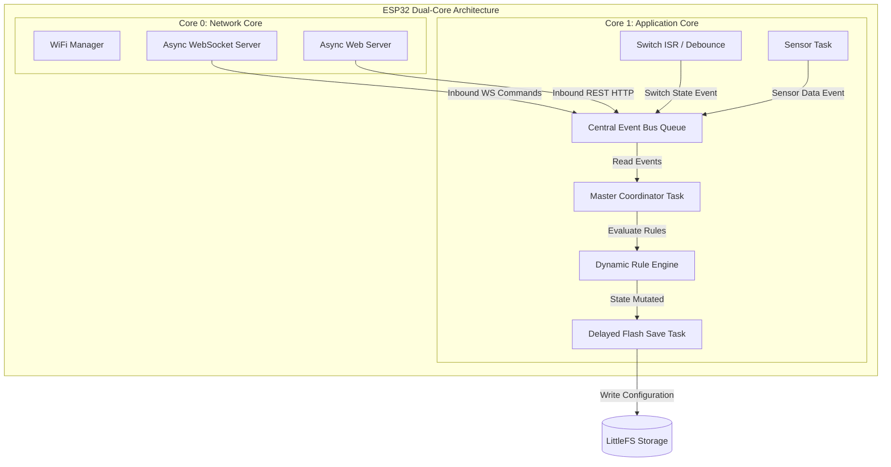
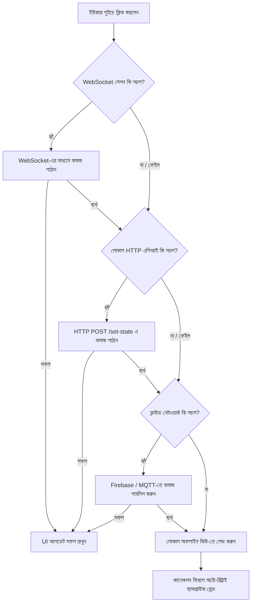

# Comprehensive Architecture & Implementation Specifications (ESPHome)

> [!NOTE]
> এই ডকুমেন্টটি নতুন লোকাল-ফার্স্ট আইওটি (IoT) নোড সিস্টেমের চূড়ান্ত আর্কিটেকচার, মেথডলজি এবং ধাপে ধাপে ইমপ্লিমেন্টেশন প্ল্যান নির্দেশ করে। পূর্ববর্তী সংস্করণের (v3.2.2) অভিজ্ঞতার আলোকে এই সিস্টেমে হার্ডওয়্যার রিসোর্সের সর্বোচ্চ সাশ্রয়, মেমরি সেফটি এবং ফল্ট-টলারেন্স নিশ্চিত করা হয়েছে।

---

## ১. সিস্টেম ডিজাইন ও ডুয়াল-কোর বন্টন (Dual-Core Allocation)

ESP32-এর ডুয়াল-কোর আর্কিটেকচারকে ওয়াচডগ ক্র্যাশ এবং নেটওয়ার্ক ল্যাগ থেকে মুক্ত রাখতে টাস্কগুলোকে সুনির্দিষ্টভাবে ভাগ করা হয়েছে:

### A. Core 0: ডেডিকেটেড নেটওয়ার্ক স্ট্যাক (Network Isolation)
* **মূল কাজসমূহ:** `WiFi Management`, `TCP/IP Stack`, `AsyncWebServer` ব্যাকগ্রাউন্ড থ্রেড, এবং `WebSocket` কানেকশন হ্যান্ডলিং।
* **ডিজাইন যুক্তি:** Core 0-তে কোনো ভারী প্রসেসিং বা ফাইল সিস্টেম রাইটের মতো ব্লকিং টাস্ক রাখা হবে না। এর ফলে ওয়াইফাই স্ট্যাক সময়মতো প্রসেস হতে পারবে এবং নেটওয়ার্ক ড্রপআউট (Network Dropout) সম্পূর্ণ এড়ানো যাবে।

### B. Core 1: কোর অ্যাপ্লিকেশন ও লজিক ইঞ্জিন (Application Core)
* **মূল কাজসমূহ:** `Central Event Bus`, ফিজিক্যাল সুইচ ইন্টারাপ্ট (ISR) হ্যান্ডলিং, সেন্সর টাস্ক, ডাইনামিক রুল ইঞ্জিন এবং ফ্ল্যাশ রাইট টাস্ক।

### C. টাস্ক প্রায়োরিটি ম্যাট্রিক্স (FreeRTOS Priorities)

Core 1-এ রান করা টাস্কগুলোর প্রায়োরিটি নিচের তালিকা অনুযায়ী নির্ধারিত হবে:

| Priority | Task/Handler Name | Core | Criticality | Functionality |
| :---: | :--- | :---: | :---: | :--- |
| **1 (Highest)** | `Switch ISR / Debounce Handler` | Core 1 | Real-time | ফিজিক্যাল সুইচ ইন্টারাপ্ট ও বাউন্স ফিল্টারিং |
| **2 (High)** | `Master Coordinator Task` | Core 1 | High | সেন্ট্রাল ইভেন্ট কিউ প্রসেস এবং রাউটিং |
| **3 (Medium)** | `Sensor & Dynamic Rule Engine Task`| Core 1 | Medium | সেন্সর রিডিং ও রুলস ডাইনামিক ইভ্যালুয়েশন |
| **4 (Low)** | `Delayed Flash Save Task` | Core 1 | Low | ফাইল সিস্টেমে সেভ অপারেশন সমন্বয় করা |

### D. সিস্টেম আর্কিটেকচার ফ্লো (Data & Task Flow)



---

## ২. লাইটওয়েট ডাটা অবফাসকেশন ও ভ্যালিডেশন (Security Layer)

ভারী ক্রিপ্টোগ্রাফি (AES/TLS) এড়িয়ে CPU সাইকেল এবং হিপ মেমরি বাঁচাতে একটি কাস্টম লাইটওয়েট অবফাসকেশন লেয়ার ব্যবহার করা হবে:

### A. কাস্টম JSON Shifting অ্যালগরিদম
* **মেকানিজম:** লোকাল HTTP/WebSocket-এ JSON পে-লোড পাঠানোর আগে স্ট্রিংয়ের প্রতিটি ক্যারেক্টারের ASCII ভ্যালুর সাথে নোডের `mac4` এবং একটি কাস্টম সিক্রেট কী (Key) ম্যাথমেটিক্যাল শিফটিং করা হবে।
* **সুবিধা:** প্রসেসরের ওপর মাত্র $< 0.1\%$ চাপও পড়বে না, অথচ নেটওয়ার্কে কেউ প্যাকেট স্নিফ (Sniff) করলে সম্পূর্ণ অবোধ্য আবর্জনা ডেটা (Garbage Data) দেখবে।

### B. আইডেন্টিটি ভেরিফিকেশন (`mac4` Check)
* প্রতিটি ইনবাউন্ড REST API এবং WebSocket রিকোয়েস্টে টার্গেট নোডের MAC অ্যাড্রেসের শেষ ৪ ডিজিট (`mac4`) থাকা বাধ্যতামূলক। 
* নোড নিজের MAC এর সাথে এটি মিলিয়ে দেখবে, অমিল হলে সরাসরি `409 Conflict` রিটার্ন করবে।

---

## ৩. ডাইনামিক রুল ইঞ্জিন (Tokenized Rule Engine)

কোড রি-ফ্ল্যাশ না করেই ইউজার যাতে অ্যাপ থেকে যেকোনো কাস্টম অটোমেশন সেট করতে পারে, সেজন্য একটি লাইটওয়েট রুল ইঞ্জিন ডিজাইন করা হয়েছে:

### A. রুল স্ট্রাকচার (`rules.json`)
অটোমেশনগুলো LittleFS-এ একটি কম্প্যাক্ট টোকেনাইজড ফরম্যাটে সেভ থাকবে:

```json
{
  "rules": [
    {
      "id": 101,
      "trigger_type": "sensor",
      "source": "temperature",
      "operator": ">",
      "threshold": 30.0,
      "action_target": "fan_relay",
      "action_value": 1
    }
  ]
}
```

### B. এক্সিকিউশন লজিক ও বাউন্স প্রোটেকশন
* **SensorTask এক্সিকিউশন:** Core 1-এ রান করা `SensorTask` প্রতি ১০ সেকেন্ড পর পর সেন্সর রিডিং নেওয়ার পর এই রুল অ্যারেটি লুপ চালিয়ে ইভ্যালুয়েট করবে।
* **হিস্টেরেসিস (Hysteresis):** রিলে অসিলেশন বা বারবার খটখট করা বন্ধ করতে $\pm 0.5^\circ\text{C}$ থেকে $1.0^\circ\text{C}$ ডিফারেন্সিয়াল অফসেট লজিক কাজ করবে। 
  > *উদাহরণস্বরূপ:* যদি থ্রেশহোল্ড $30.0^\circ\text{C}$ এবং হিস্টেরেসিস $1.0^\circ\text{C}$ হয়, তবে ফ্যানটি চালু হবে $30.0^\circ\text{C}$-এর উপরে গেলে, কিন্তু বন্ধ হবে যখন তাপমাত্রা $29.0^\circ\text{C}$-এর নিচে নেমে আসবে।

---

## ৪. রিসোর্স অপ্টিমাইজেশন ও মেমরি সেফটি

### A. ফিক্সড-সাইজ অ্যারে এলোকেশন
রানটাইমে কোনো `String` ক্লাস বা ডাইনামিক `malloc()` ব্যবহার করা হবে না। সেন্ট্রাল ইভেন্ট বাসের `AppEvent` স্ট্রাক্ট এবং কমান্ড কিউতে ফিক্সড-সাইজ ক্যারেক্টার অ্যারে (যেমন: `char targetID[16]`, `char dataBuffer[128]`) ব্যবহার করা হবে, যা Heap Fragmentation সম্পূর্ণ রোধ করবে।

### B. ডিলেড ফ্ল্যাশ সিরিয়ালাইজেশন (Coalesced Writes)
স্টেট পরিবর্তনের সাথে সাথে LittleFS-এ রাইট না করে ৩ সেকেন্ডের একটি ক্যাশ ডিলে কাউন্টার সেট করা হবে (`scheduleDelayedFlashWrite`)। ৩ সেকেন্ডের মধ্যে একাধিক স্টেট চেঞ্জ হলে তা মেমরিতে ঘটবে এবং সময় শেষ হলে একবারে ফাইল সিস্টেমে সেভ হবে, যা ফ্ল্যাশ মেমরির লাইফস্প্যান বাড়াবে।

### C. হিপ ফ্র্যাগমেন্টেশন ল্যাচ (Heap Guard)
Continuous Free Memory Block ২৫ KB-এর নিচে নামলে সিস্টেম কম-প্রাইওরিটি সম্পন্ন ক্লাউড লগ এবং হার্টবিট ব্রডকাস্ট সাময়িকভাবে ল্যাচ (Lock) করে বন্ধ করে দেবে। ফ্রি হিপ ৩০ KB-এর উপরে উঠলে ল্যাচটি রিলিজ হবে।

---

## ৫. টাস্ক-ওয়াইজ কাস্টম ওয়াচডগ (Task WD Timers)

সিস্টেমের দীর্ঘমেয়াদী স্ট্যাবিলিটির জন্য এবং কোনো নির্দিষ্ট থ্রেড বা লুপ হ্যাং হয়ে গেলে তা রিকভার করতে ফ্রি-আরটিওএস ওয়াচডগ ব্যবহার করা হবে:

* **বাস্তবায়ন:** `esp_task_wdt_add()` ব্যবহার করে `Master Coordinator Task` এবং `SensorTask`-কে কাস্টম ওয়াচডগে রেজিস্টার করা হবে।
* **টাইমআউট:** যদি কোনো কারণে (যেমন: LittleFS এরর বা ইনফিনিট লুপ) কোনো টাস্ক ৩ সেকেন্ডের মধ্যে ওয়াচডগ ফিড (`esp_task_wdt_feed()`) না করে, তবে সিস্টেম স্বয়ংক্রিয়ভাবে একটি ক্লিন রিবুট (Software Reset) নেবে এবং রিবুটের কারণ `crash_logs.json`-এ সেভ করবে।

---

## ৬. পার্ট-বাই-পার্ট ইমপ্লিমেন্টেশন রোডম্যাপ (Implementation Plan)

### পার্ট ১: ফাউন্ডেশন এবং মেমরি আর্কিটেকচার (Week 1)
* [ ] LittleFS ইনিশিয়ালাইজেশন এবং `config.json`, `states.json` ফাইল স্ট্রাকচার তৈরি।
* [ ] ফিক্সড-সাইজ বাফারসহ সেন্ট্রাল ইভেন্ট বাস (`QueueHandle_t`) এবং `AppEvent` স্ট্রাক্ট ডিফাইন করা।
* [ ] Core 1-এ `Master Coordinator Task` চালু করা এবং ইভেন্ট প্রসেসিং টেস্ট করা।
* [ ] রিকার্সিভ মিউটেক্স (`sysMutex`) এবং RAII Wrapper ক্লাস ইমপ্লিমেন্টেশন।

### পার্ট ২: হার্ডওয়্যার ইন্টারফেসিং ও ISR (Week 2)
* [ ] রানটাইম পিন ও আইডি কনফ্লিক্ট ভ্যালিডেশন লজিক তৈরি করা।
* [ ] `IRAM_ATTR` যুক্ত ফিজিক্যাল সুইচ ISR তৈরি এবং সেন্ট্রাল বাসে `EVENT_PHYSICAL_SWITCH_TOGGLED` পুশ করা।
* [ ] ৫০ মিলি-সেকেন্ডের সফটওয়্যার ডিবন্সিং লজিক ইমপ্লিমেন্টেশন।
* [ ] ৩ সেকেন্ডের ডিলেড ফ্ল্যাশ রাইট মেকানিজম ভেরিফিকেশন।

### পার্ট ৩: নেটওয়ার্কিং ও লাইটওয়েট সিকিউরিটি (Week 3)
* [ ] Core 0-তে `WiFiManager` এবং `AsyncWebServer` / `AsyncWebSocketsServer` সেটআপ।
* [ ] কাস্টম JSON Shifting (Obfuscation) অ্যালগরিদম তৈরি (Encryption/Decryption functions)।
* [ ] ইনবাউন্ড রিকোয়েস্টে `mac4` এবং `x-api-key` ভেরিফিকেশন মিডলওয়্যার যুক্ত করা।
* [ ] UDP পোর্ট ৪২১০-এ ১৫ সেকেন্ডের পিয়ার হার্টবিট এবং ডিসকভারি ইঞ্জিন চালু করা।

### পার্ট ৪: সেন্সর ও ডাইনামিক রুল ইঞ্জিন (Week 4)
* [ ] Core 1-এ প্রতি ১০ সেকেন্ডের অ্যাসিনক্রোনাস `SensorTask` তৈরি।
* [ ] `rules.json` থেকে টোকেনাইজড রুল লোড এবং রানটাইম ইভ্যালুয়েশন লজিক ডেভেলপমেন্ট।
* [ ] হাইস্টেরেসিস (Hysteresis) ও অ্যান্টি-অসিলেশন ফিল্টার যুক্ত করা।
* [ ] লোকাল-টু-ক্লাউড হাইব্রিড ফেইলব্যাক (Cloud Failover) লজিক ইমপ্লিমেন্টেশন।

### পার্ট ৫: স্ট্যাবিলিটি ও ফাইনাল টেস্টিং (Week 5)
* [ ] `Master Coordinator` এবং `SensorTask`-এর জন্য কাস্টম Task Watchdog Timer (TWDT) যুক্ত করা।
* [ ] হিপ ফ্র্যাগমেন্টেশন গার্ড (২৫ KB ল্যাচ মেকানিজম) টেস্ট করা।
* [ ] স্ট্যাগার্ড ক্লাউড ইনিশিয়ালাইজেশন (১৫০০ মি.সে. ডিলে) যুক্ত করা।
* [ ] টানা ৭ দিন লং-রান পারফরম্যান্স এবং মেমরি লিক অ্যানালিসিস লগ ভেরিফিকেশন।

---

## ৭. ESP32-নির্দিষ্ট অপ্টিমাইজেশন ও মেমরি সাশ্রয় (ESP32-Specific Optimization & Memory Efficiency)

ESP32-এর হার্ডওয়্যার রিসোর্সের সর্বোচ্চ ব্যবহার এবং মেমরি ব্যবহার (SRAM) আরও সাশ্রয়ী করতে নিম্নলিখিত ডিজাইন প্যাটার্নগুলো ব্যবহার করা হবে:

### A. ফ্রি-আরটিওএস টাস্ক নোটিফিকেশন (Direct-to-Task Notifications)
* **কনসেপ্ট:** `QueueHandle_t` বা সেন্ট্রাল ইভেন্ট বাস কিউ ব্যবহারে ওভারহেড ও হিপ মেমরি খরচ হয়। যেসব জায়গায় কেবল একমুখী সিগন্যাল বা ১-বিট ফ্ল্যাগ পাঠানো দরকার, সেখানে কিউ-এর পরিবর্তে FreeRTOS-এর ডেডিকেটেড `xTaskNotify()` এবং `xTaskNotifyWait()` ব্যবহার করা হবে।
* **সুবিধা:** এটি কোনো হিপ মেমরি (Heap Memory) অ্যালোকেট করে না এবং কিউ-এর তুলনায় প্রায় $৪৫\%$ দ্রুত রান করে।

### B. আরটিসি মেমরি ব্যবহার (RTC RAM Utilization for Deep Sleep/Reset Recovery)
* **কনসেপ্ট:** ডিভাইসের মূল স্টেট বা রানিং কনফিগ (যেমন: লোড অন/অফ স্টেট) `RTC_DATA_ATTR` মডিফায়ার দিয়ে ডিক্লেয়ার করা হবে।
  ```cpp
  RTC_DATA_ATTR bool loadStates[MAX_LOADS];
  ```
* **সুবিধা:** সফটওয়্যার ক্র্যাশ রিস্টার্ট অথবা ডিপ-স্লিপ (Deep Sleep) থেকে ওয়েক-আপের সময় এই স্টেটগুলো মেমরিতে সংরক্ষিত থাকবে। ফলে LittleFS ফাইল সিস্টেম থেকে বারবার ফাইল রিড বা রাইট করতে হবে না, যা মেমরি সেফটি ও ফ্ল্যাশ লাইফস্প্যান উভয়ই বৃদ্ধি করবে।

### C. টাস্ক স্ট্যাক সাইজ টিউনিং (Task Stack Tuning via High Water Mark)
* **কনসেপ্ট:** প্রতিটি FreeRTOS টাস্ক তৈরির সময় (যেমন: `SensorTask`) হিপ মেমরি থেকে স্ট্যাক স্পেস দেওয়া হয়। রানটাইমে `uxTaskGetStackHighWaterMark()` ফাংশন দিয়ে মনিটর করা হবে যে সর্বোচ্চ কাজের সময় কতটুকু স্ট্যাক আন-ইউজড (Unused) থাকে।
* **সুবিধা:** ট্র্যাকিংয়ের মাধ্যমে অতিরিক্ত স্ট্যাক সাইজ কমিয়ে আনা হবে, যাতে অব্যবহৃত মেমরি পুনরায় সেন্ট্রাল হিপে ফেরত আসে।

### D. আইআরএএম-এ আইএসআর ফাংশন পিন করা (IRAM Pinning for ISR)
* **কনসেপ্ট:** ফিজিক্যাল সুইচের ISR এবং এর ভেতর কল হওয়া ফাংশনগুলোতে `IRAM_ATTR` মডিফায়ার ব্যবহার করা হবে।
* **সুবিধা:** ফ্ল্যাশ রাইটের সময় (যেমন LittleFS-এ ফাইল সেভের সময়) ক্যাশ কন্ট্রোলার লক হয়ে যায়। যদি ISR ফ্ল্যাশ মেমরিতে থাকে, তবে ক্যাশ মিসের কারণে ওয়াচডগ ক্র্যাশ (Cache Helper Timeout) হতে পারে। `IRAM_ATTR` ব্যবহার করলে কোড সরাসরি ইন্টারনাল র‍্যাম থেকে এক্সিকিউট হয়, যা ক্র্যাশ সম্পূর্ণ রোধ করে।

### E. পিএসআরএএম এবং ক্যাপাবিলিটি-ভিত্তিক মেমরি এলোকেশন (PSRAM & Malloc Caps)
* **কনসেপ্ট:** যদি সিস্টেমে এক্সটার্নাল PSRAM (যেমন ESP32 WROVER মডিউলে) থাকে, তবে মেমরি অ্যালোকেশনকে সুনির্দিষ্ট করতে `heap_caps_malloc()` ব্যবহার করা হবে।
* **সুবিধা:** বড় আকারের JSON বাফার বা ওয়েব সার্ভার রেসপন্সের জন্য `MALLOC_CAP_SPIRAM` এবং সময়-সংবেদনশীল (time-critical) রিয়েল-টাইম অ্যাপ্লিকেশনের জন্য ইন্টারনাল দ্রুতগতির র‍্যাম `MALLOC_CAP_INTERNAL` নির্দিষ্ট করে দেওয়া হবে।

### F. বাইনারি ইউডিপি প্রোটোকল ব্যবহার (Binary UDP Protocol over JSON)
* **কনসেপ্ট:** লোকাল নেটওয়ার্কে পিয়ার-টু-পিয়ার (P2P) যোগাযোগের ক্ষেত্রে ভারী JSON ফরম্যাটের পরিবর্তে সরাসরি C-Struct ডাটা প্যাক করে বাইনারি ফরম্যাটে UDP প্যাকেটের মাধ্যমে পাঠানো হবে।
* **সুবিধা:** JSON পার্সিংয়ের প্রসেসর ওভারহেড থাকবে না এবং ডাইনামিক স্ট্রিং অ্যালোকেশনের কোনো প্রয়োজন পড়বে না।

---

## ৮. ফ্রন্টএন্ড ডিজাইন মেথডোলজি ও নির্দেশিকা (Frontend Design Methodology)

একটি দ্রুত, নিরাপদ এবং ফল্ট-টলারেন্ট ইউজার ইন্টারফেস (UI) তৈরি করতে ফ্রন্টএন্ড অ্যাপ্লিকেশনে নিচের ডিজাইন মেথডোলজিগুলো অনুসরণ করা হবে:

### A. লোকাল-ফার্স্ট নোড ডিসকভারি (Local-First Discovery & Autopairing)
* **স্ক্যানিং মেকানিজম:** অ্যাপ ব্যাকগ্রাউন্ডে UDP পোর্ট `৪২১০`-এ ব্রডকাস্ট স্ক্যান চালাবে। কোনো নোড থেকে `NODE_PULSE` মেসেজ পাওয়ার সাথে সাথে অ্যাপ সেটি ডিটেক্ট করে স্ক্রিনে "New Node Found" পপ-আপ দেখাবে।
* **লোকাল ডাটাবেস ম্যাপিং:** নোডের ইউনিক MAC অ্যাড্রেসকে প্রাইমারি কী হিসেবে ব্যবহার করে মোবাইল অ্যাপের লোকাল ডাটাবেসে (যেমন: SQLite/IndexedDB) নোডের নাম (যেমন: "Master Bedroom") এবং রিলে কনফিগ স্টোর করা হবে।

### B. ফলব্যাক কানেকশন পাইপলাইন (Resilient Connection Pipeline Flow)

ইউজার যখন অ্যাপে কোনো সুইচ টগল করবেন, তখন মেসেজটি দ্রুততম উপায়ে নোডে পৌঁছানোর জন্য নিচের ফলব্যাক কানেকশন চেইন ব্যবহার করা হবে:



### C. ডিকোডিং ও অবফাসকেশন মিডলওয়্যার (Security & Decryption)
* **ডাটা প্রসেসিং:** নোড থেকে আসা প্রতিটি রেসপন্স এবং পে-লোড রিড করার আগে ফ্রন্টএন্ডে একটি কাস্টম মিডলওয়্যার চালনা করা হবে। এই মিডলওয়্যারটি নোডের `mac4` ও কাস্টম সিক্রেট কী ব্যবহার করে JSON শ্রিফটিং অবফাসকেশন রিভার্স (Reverse Shift) করে আসল JSON ডাটা রিকভার করবে।
* **আইডেন্টিটি অথরাইজেশন:** নোডে পাঠানো প্রতিটি রিকোয়েস্টের হেডারে `x-api-key` এবং টার্গেট নোডের `mac4` প্যাক করতে হবে, অন্যথায় এপিআই সার্ভার রিকোয়েস্ট রিজেক্ট করে `409 Conflict` রিটার্ন করবে।

### D. ডাইনামিক কনফিগ হ্যাশ ট্র্যাকিং (Config Hash Tracking)
* **হ্যাশ ভ্যালিডেশন:** প্রতিবার স্টেট পরিবর্তনের পর রেসপন্সের সাথে নোডের কনফিগ হ্যাশ (`djb2 configHash`) চেক করা হবে।
* **ডাইনামিক রেন্ডারিং:** যদি লোকাল অ্যাপে সংরক্ষিত হ্যাশের সাথে রেসপন্সের হ্যাশে কোনো অমিল পাওয়া যায়, তবে অ্যাপ বুঝবে নোডের পিন বা নামের কনফিগারেশনে পরিবর্তন এসেছে। সাথে সাথে ব্যাকগ্রাউন্ডে নতুন কনফিগ রিকোয়েস্ট করবে এবং UI স্ক্রিন লেআউট ডাইনামিকালি পুনরায় বিল্ড (Re-render) করবে।

### E. অপ্টিমিস্টিক ইউআই আপডেট (Optimistic UI Updates)
* **ইউজার এক্সপেরিয়েন্স:** লেটেন্সি কমাতে ইউজার যখন কোনো ডিভাইসের বাটন প্রেস করবেন, অ্যাপ সাথে সাথে স্টেটের সফল পরিবর্তনের ভিজ্যুয়াল ফিডব্যাক দেখাবে (Optimistic Update)।
* **রোলব্যাক মেকানিজম:** যদি কানেকশন পাইপলাইনের সবগুলো অপশন ব্যর্থ হয় এবং অফলাইন কিউতে ডাটা চলে যায়, তবে বাটন স্টেটটি রিভার্ট (Rollback) করে ইউজারকে নোটিফিকেশনের মাধ্যমে জানানো হবে।

---

## ৯. সিস্টেম টেস্টিং ও ভ্যালিডেশন প্রোটোকল (System Testing & Validation Protocol)

সিস্টেমের মেমরি স্ট্যাবিলিটি, রিয়েল-টাইম পারফরম্যান্স এবং ডাটা সেফটি নিশ্চিত করতে ৫টি ধাপে কঠোর টেস্টিং প্রোটোকল অনুসরণ করা হবে:

### A. ইউনিট টেস্টিং (Unit Testing via Unity Framework)
* **টেস্ট ফ্রেমওয়ার্ক:** ESP-IDF বা Arduino ESP32-এর জন্য স্ট্যান্ডার্ড `Unity Test Framework` ব্যবহার করে ফার্মওয়্যারের প্রতিটি মডিউল এককভাবে টেস্ট করা হবে।
* **মূল টেস্ট কেসসমূহ:**
  1. **JSON Shifting অবফাসকেশন টেস্ট:** একটি নির্দিষ্ট ক্যারেক্টার স্ট্রিংকে অবফাসকেট করার পর ডিক্রিপ্ট করে মূল ডাটা পাওয়া যাচ্ছে কিনা এবং প্রসেসিং টাইম $< ১\text{ ms}$ এর নিচে রয়েছে কিনা তা যাচাই করা।
  2. **রুল ইঞ্জিন ইভ্যালুয়েশন:** `rules.json`-এর বিভিন্ন ইভেন্ট কন্ডিশন (যেমন: sensor threshold, logic comparison) দিয়ে সঠিক আউটপুট অ্যাকশন ফায়ার হচ্ছে কিনা তা টেস্ট করা।
  3. **হ্যাশ অ্যালগরিদম ভ্যালিডেশন:** ডিভাইস কনফিগারেশন সামান্য পরিবর্তন করে `djb2 configHash` জেনারেশন চেক করা এবং তা ইউনিক হচ্ছে কিনা যাচাই করা।

### B. মেমরি সেফটি ও লিক টেস্টিং (Memory & Heap Guard Verification)
* **হিপ মনিটরিং:** প্রতি ১০ সেকেন্ড পর পর `ESP.getFreeHeap()` এবং `ESP.getMaxAllocHeap()` মেট্রিক্স সিরিয়াল লগে প্রিন্ট করা হবে।
* **গার্ড টেস্ট (Guard Injections):** সিস্টেমে কৃত্রিমভাবে ফ্রি মেমরি ২৫ KB-এর নিচে নামিয়ে টেস্ট করা হবে যে হিপ গার্ড (Heap Guard) ল্যাচটি সফলভাবে কম-গুরুত্বপূর্ণ ব্রডকাস্ট লক করে দেয় কিনা এবং ফ্রি মেমরি ৩০ KB-এর উপরে উঠলে ল্যাচ রিলিজ করে কিনা।
* **মিউটেক্স লক-টাইমআউট ভেরিফিকেশন:** `sysMutex` লকের টাইমআউট (৫০ ms) ট্রিগার করে টেস্ট করা হবে যে কোনো টাস্ক ইনফিনিট টাইম ব্লক হয়ে থাকছে কিনা।

### C. সুইচ ISR ও ডিবন্সিং ভ্যালিডেশন (ISR & Hardware Simulation)
* **ইনপুট নয়েজ সিমুলেশন:** একটি সিগন্যাল জেনারেটর ব্যবহার করে সুইচের পিনে উচ্চ ফ্রিকোয়েন্সির বাউন্স বা নয়েজ ($১০\text{ ms}$ থেকে $৪০\text{ ms}$ ইন্টারভ্যাল) পাঠানো হবে।
* **ফিল্টারিং ভেরিফিকেশন:** ৫০ মিলি-সেকেন্ডের সফটওয়্যার ডিবন্স ফিল্টার সফলভাবে অতিরিক্ত ট্র্রিগার বা বাউন্স রিজেক্ট করে কেবল স্টেবল স্টেট পরিবর্তনগুলোকে ডিটেক্ট করছে কিনা তা নিশ্চিত করা হবে।
* **ISR সেফটি চেক:** ইন্টারাপ্ট সার্ভিস রুটিনের ভেতরে সরাসরি কোনো মেমরি এলোকেশন বা LittleFS রাইট এক্সিকিউট হচ্ছে কিনা তা স্ট্যাটিক কোড অ্যানালাইসিস এবং রানটাইম ট্র্যাকিং দ্বারা কঠোরভাবে চেক করা হবে।

### D. নেটওয়ার্ক রেসিলিয়েন্সি ও ফেইলওভার টেস্টিং (Resiliency & Connection Failover)
* **ওয়াইফাই সংযোগ বিচ্ছিন্নকরণ টেস্ট:** ব্যাকগ্রাউন্ডে অনবরত ডেটা প্রসেসিংয়ের সময় নোডের ওয়াইফাই রাউটার অফ করে দেওয়া হবে। যাচাই করা হবে যে Core 0 নেটওয়ার্ক রিকভারি লুপে রান করলেও Core 1-এর সেন্সর এবং ফিজিক্যাল সুইচ কন্ট্রোল কোনো প্রকার ল্যাগ ছাড়াই সচল থাকে কিনা।
* **ফ্রন্টএন্ড ফলব্যাক লুপ টেস্টিং:** ফ্রন্টএন্ড থেকে কমান্ড পাঠানোর সময় ধারাবাহিকভাবে:
  1. WebSocket ব্লক করে REST HTTP-তে ডাউনগ্রেড চেক করা হবে।
  2. HTTP পোর্ট ব্লক করে Firebase/MQTT ক্লাউড কিউ-তে ডাউনগ্রেড চেক করা হবে।
  3. ইন্টারনেটের সম্পূর্ণ সংযোগ কেটে দিয়ে অফলাইন SQLite কিউ-তে লোকাল ডাটা ক্যাশিং চেক করা হবে এবং নেটওয়ার্ক রিস্টোর হলে অটো-সিঙ্ক ভেরিফাই করা হবে।

### E. স্ট্রেস ও লং-রান স্ট্যাবিলিটি টেস্টিং (Stress & 168-Hour Soak Testing)
* **লোড টেস্টিং:** কাস্টম স্ক্রিপ্ট দিয়ে নোডের লোকাল HTTP ও WebSocket সার্ভারে প্রতি সেকেন্ডে ৫০টি করে রিকোয়েস্ট পাঠিয়ে রেসপন্স টাইম ও হিপ স্ট্যাবিলিটি ট্র্যাক করা হবে।
* **TWDT ফেইলর ইনজেকশন:** `SensorTask`-এর ভেতর একটি কৃত্রিম ইনফিনিট লুপ তৈরি করে টেস্ট করা হবে যে ৩ সেকেন্ড পর কাস্টম টাস্ক ওয়াচডগ টাইমার ডিভাইসকে ক্লিন সফটওয়্যার রিসেট দেয় কিনা এবং `crash_logs.json`-এ ক্র্যাশের সঠিক তথ্য সেভ করে কিনা।
* **৭ দিনের সোক টেস্টিং (168-Hour Soak Test):** নোডটিকে সম্পূর্ণ লোড অবস্থায় টানা ১৬৮ ঘণ্টা (৭ দিন) চালু রাখা হবে। প্রতি ঘণ্টার ফ্রি হিপ মেমরি গ্রাফে বিশ্লেষণ করে নিশ্চিত করা হবে যে সিস্টেমে কোনো প্রকার মেমরি লিক (Memory Leak) বা রিসোর্স ড্রিপ নেই।