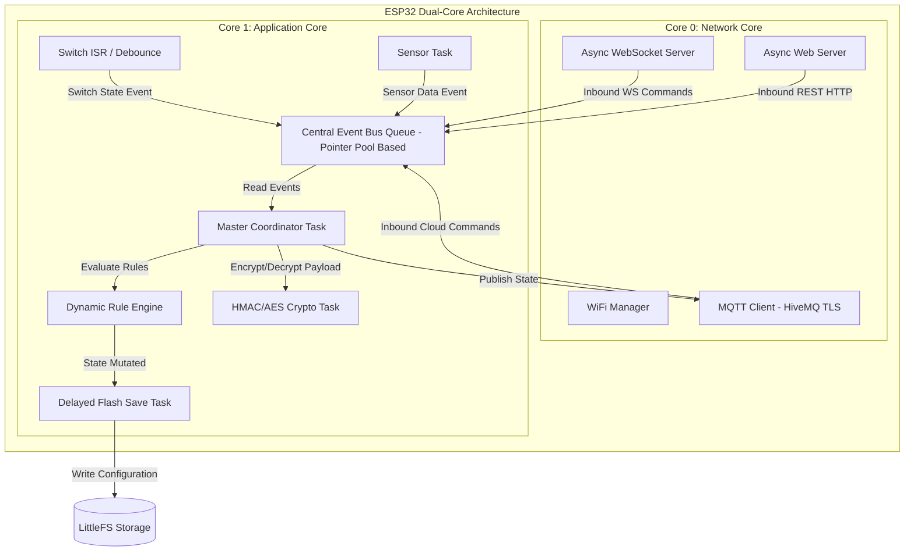
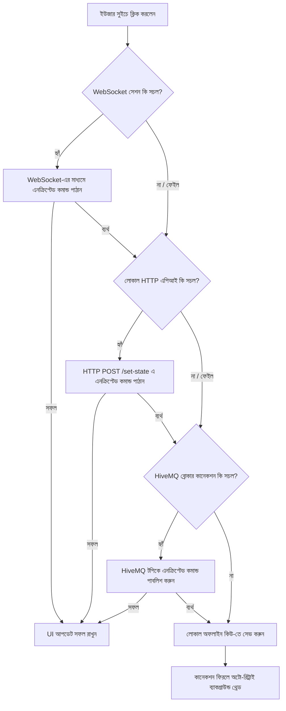

# Comprehensive Architecture & Implementation Specifications (ESPHome) — v2.1

> [!NOTE]
> এই ডকুমেন্টটি v2.0-এর আপডেটেড সংস্করণ। মূল পরিবর্তনগুলো: (১) কাস্টম "JSON Shifting" অবফাসকেশনের পরিবর্তে HMAC-SHA256 ভিত্তিক টাইমস্ট্যাম্প-রোটেটিং কি ডেরিভেশন এবং ESP32-এর ডেডিকেটেড হার্ডওয়্যার ক্রিপ্টো ইঞ্জিন ব্যবহার করে AES-128-CBC এনক্রিপশন যুক্ত করা হয়েছে, (২) ডিভাইস-টু-ডিভাইস/ক্লাউড কমিউনিকেশনের জন্য Firebase RTDB-এর পরিবর্তে HiveMQ (MQTT) ব্যবহার করা হবে — Firebase শুধুমাত্র অ্যাপের ইউজার ম্যানেজমেন্টের জন্য সংরক্ষিত থাকবে, (৩) সেন্ট্রাল ইভেন্ট বাসে raw stack pointer পাঠানোর পরিবর্তে প্রি-অ্যালোকেটেড মেমোরি পুল ও ফ্রি-লিস্ট প্যাটার্ন ব্যবহার করা হবে যাতে dangling pointer crash এবং heap fragmentation উভয়ই এড়ানো যায়।
আর CPP/Firmware code OOP structure follow করে লিখা হবে। এবং frontend app flutter use করে তৈরি করা হবে।

---

## ১. সিস্টেম ডিজাইন ও ডুয়াল-কোর বন্টন (Dual-Core Allocation)

ESP32-এর ডুয়াল-কোর আর্কিটেকচারকে ওয়াচডগ ক্র্যাশ এবং নেটওয়ার্ক ল্যাগ থেকে মুক্ত রাখতে টাস্কগুলোকে সুনির্দিষ্টভাবে ভাগ করা হয়েছে:

### A. Core 0: ডেডিকেটেড নেটওয়ার্ক স্ট্যাক (Network Isolation)
* **মূল কাজসমূহ:** `WiFi Management`, `TCP/IP Stack`, `AsyncWebServer` ব্যাকগ্রাউন্ড থ্রেড, `WebSocket` কানেকশন হ্যান্ডলিং, এবং `MQTT Client Task` (HiveMQ সংযোগের জন্য)।
* **ডিজাইন যুক্তি:** Core 0-তে কোনো ভারী প্রসেসিং বা ফাইল সিস্টেম রাইটের মতো ব্লকিং টাস্ক রাখা হবে না। এর ফলে ওয়াইফাই স্ট্যাক সময়মতো প্রসেস হতে পারবে এবং নেটওয়ার্ক ড্রপআউট (Network Dropout) সম্পূর্ণ এড়ানো যাবে।

### B. Core 1: কোর অ্যাপ্লিকেশন ও লজিক ইঞ্জিন (Application Core)
* **মূল কাজসমূহ:** `Central Event Bus`, ফিজিক্যাল সুইচ ইন্টারাপ্ট (ISR) হ্যান্ডলিং, সেন্সর টাস্ক, ডাইনামিক রুল ইঞ্জিন, ক্রিপ্টো অপারেশন (AES/HMAC — হার্ডওয়্যার ইঞ্জিন ব্যবহৃত হলেও ট্রিগারিং টাস্ক এখানে থাকবে), এবং ফ্ল্যাশ রাইট টাস্ক।

### C. টাস্ক প্রায়োরিটি ম্যাট্রিক্স (FreeRTOS Priorities)

| Priority | Task/Handler Name | Core | Criticality | Functionality |
| :---: | :--- | :---: | :---: | :--- |
| **1 (Highest)** | `Switch ISR / Debounce Handler` | Core 1 | Real-time | ফিজিক্যাল সুইচ ইন্টারাপ্ট ও বাউন্স ফিল্টারিং |
| **2 (High)** | `Master Coordinator Task` | Core 1 | High | সেন্ট্রাল ইভেন্ট কিউ প্রসেস এবং রাউটিং |
| **3 (Medium)** | `Sensor & Dynamic Rule Engine Task`| Core 1 | Medium | সেন্সর রিডিং ও রুলস ডাইনামিক ইভ্যালুয়েশন |
| **3 (Medium)** | `MQTT Publish/Subscribe Task` | Core 0 | Medium | HiveMQ ব্রোকারের সাথে পাব/সাব সিঙ্ক |
| **4 (Low)** | `Delayed Flash Save Task` | Core 1 | Low | ফাইল সিস্টেমে সেভ অপারেশন সমন্বয় করা |

### D. সিস্টেম আর্কিটেকচার ফ্লো (Data & Task Flow)



---

## ২. সিকিউরিটি লেয়ার: টাইমস্ট্যাম্প-রোটেটিং কি ডেরিভেশন + হার্ডওয়্যার AES-128-CBC

আগের সংস্করণে (v2.0) ব্যবহৃত কাস্টম মাল্টিপ্লিকেশন/শিফট-ভিত্তিক অবফাসকেশন cryptographically ভাঙা ছিল — timestamp জানা থাকলে (যা attacker সহজেই অনুমান করতে পারে) একটিমাত্র captured প্যাকেট থেকেই permanent secret বের করে ফেলা সম্ভব ছিল। এই সংস্করণে দুটি আলাদা স্তরে প্রপার cryptographic primitive ব্যবহার করা হয়েছে।

### A. স্তর ১ — কি ডেরিভেশন (Key Derivation via HMAC-SHA256)

* **নীতি:** আসল `api_key` **কখনোই নেটওয়ার্কে পাঠানো হবে না**। প্রতিটি রিকোয়েস্টের জন্য একটি সেশন-স্কোপড কি (`K1`) ডেরাইভ করা হবে যা টাইমস্ট্যাম্পের সাথে বাঁধা থাকবে:

  ```
  K1 = HMAC-SHA256(key = api_key, message = current_unix_timestamp)
  ```

* **বাস্তবায়ন:** ESP32-এর `mbedtls` লাইব্রেরি (Arduino-ESP32 কোরে বিল্ট-ইন) দিয়ে `mbedtls_md_hmac()` কল করা হবে। ক্লায়েন্ট (অ্যাপ) এবং নোড উভয়েই স্বাধীনভাবে একই `K1` কম্পিউট করবে — শুধু `api_key` (প্রি-শেয়ারড, কখনো ট্রান্সমিট হয় না) এবং সিঙ্কড টাইমস্ট্যাম্প ব্যবহার করে।
* **কেন multiplication/XOR নয়:** HMAC একটি one-way (preimage-resistant) ফাংশন — আউটপুট আর ইনপুট (timestamp) জানা থাকলেও `api_key` বের করা computationally infeasible। এটাই মাল্টিপ্লিকেশন-ভিত্তিক ডেরিভেশনের মূল দুর্বলতা সমাধান করে।
* **রিপ্লে প্রোটেকশন — টাইম উইন্ডো:** নোড শুধুমাত্র `±30 সেকেন্ড` উইন্ডোর মধ্যে থাকা টাইমস্ট্যাম্প accept করবে। এর বাইরের যেকোনো রিকোয়েস্ট `401 Unauthorized` সহ রিজেক্ট হবে।
* **NTP সিঙ্ক নির্ভরতা:** বুট হওয়ার পর WiFi কানেক্ট হওয়া মাত্র নোড NTP সার্ভারের সাথে সিঙ্ক করবে (RTC drift compensation)। NTP সিঙ্ক ব্যর্থ হলে নোড ক্রিটিক্যাল ওয়ার্নিং লগ করবে এবং টাইম-সেনসিটিভ অথেন্টিকেশন সাময়িকভাবে গ্রেস-উইন্ডো মোডে (বৃহত্তর টলারেন্স, লগে ফ্ল্যাগসহ) চলবে।

### B. স্তর ২ — পেলোড এনক্রিপশন (AES-128-CBC, Hardware Accelerated)

* **ইঞ্জিন:** ESP32-এর ডেডিকেটেড হার্ডওয়্যার AES এক্সিলারেটর (`mbedtls` hardware backend-এর মাধ্যমে) ব্যবহার করা হবে, যার ফলে CPU সাইকেল ওভারহেড নগণ্য।
* **কি:** স্তর ১ থেকে ডেরাইভড `K1` (১২৮ বিট, ১৬ বাইট) সরাসরি AES key হিসেবে ব্যবহৃত হবে।
* **IV (Initialization Vector) হ্যান্ডলিং:**
  * প্রতিটি মেসেজের জন্য একটি ফ্রেশ, র‍্যান্ডম IV (**১৬ বাইট**) `esp_random()` (হার্ডওয়্যার TRNG-ব্যাকড) দিয়ে জেনারেট করা হবে। **টাইমস্ট্যাম্প থেকে IV ডেরাইভ করা হবে না**, কারণ তা predictable এবং CBC-র সিকিউরিটি গ্যারান্টি ভেঙে দেয়।
  * IV সিক্রেট নয় — এটি প্লেইনটেক্সট হিসেবে ciphertext-এর সাথে প্রিপেন্ড করে পাঠানো হবে (এটি TLS-সহ সব স্ট্যান্ডার্ড ক্রিপ্টো প্রোটোকলের সাধারণ প্র্যাকটিস)।
  * **প্যাকেট ফরম্যাট:** `Base64( IV[16 bytes] || Ciphertext[N bytes] )`
* **ডিকোডিং ফ্লো (ক্লায়েন্ট সাইড):**
  1. Base64 স্ট্রিং ডিকোড করে raw bytes পাওয়া।
  2. প্রথম ১৬ বাইট IV হিসেবে আলাদা করা।
  3. বাকি বাইটগুলো ciphertext, যা `K1` (নিজে কম্পিউটেড) ও extracted IV দিয়ে AES-CBC ডিক্রিপ্ট করা হবে।
* **Padding:** AES-CBC ব্লক সাইজ ফিক্সড (১৬ বাইট) হওয়ায় PKCS#7 প্যাডিং ব্যবহার করা হবে যাতে যেকোনো দৈর্ঘ্যের JSON পেলোড ব্লক-অ্যালাইনড হয়।

> [!WARNING]
> `K1` (AES key) **কখনোই** wire-এ পাঠানো হবে না — শুধুমাত্র IV (যেটি secret নয়) transmit হয়। এই দুটি জিনিস কোডে variable-naming পর্যায়েও স্পষ্টভাবে আলাদা রাখা হবে (`sessionKey` বনাম `iv`) যাতে ভবিষ্যতে ভুলবশত key leak না হয়।

### C. আইডেন্টিটি ভেরিফিকেশন (`mac4` Check)

* প্রতিটি ইনবাউন্ড REST API এবং WebSocket রিকোয়েস্টে টার্গেট নোডের MAC অ্যাড্রেসের শেষ ৪ ডিজিট (`mac4`) থাকা বাধ্যতামূলক, এবং এটিও উপরের একই AES-CBC স্কিমে এনক্রিপ্টেড অবস্থায় পাঠানো হবে।
* নোড ডিক্রিপ্ট করার পর নিজের MAC-এর সাথে মিলিয়ে দেখবে; অমিল হলে `409 Conflict` রিটার্ন করবে।

### D. টেবিল সারাংশ — v2.0 বনাম v2.1

| বিষয় | v2.0 (আগের) | v2.1 (এই সংস্করণ) |
| :--- | :--- | :--- |
| কি ডেরিভেশন | Multiplication/Shift (`timestamp × constant`) | `HMAC-SHA256(api_key, timestamp)` |
| পেলোড সুরক্ষা | কাস্টম ASCII শিফটিং | AES-128-CBC (হার্ডওয়্যার) |
| Key transmission | পরোক্ষভাবে leak-prone | কখনোই transmit হয় না |
| Replay protection | নেই | টাইম উইন্ডো (±৩০ সে.) |
| Integrity check | djb2 হ্যাশ (নন-ক্রিপ্টোগ্রাফিক) | djb2 হ্যাশ (শুধু config-change ডিটেকশনের জন্য বহাল, সিকিউরিটির জন্য নয়) |

---

## ৩. ডাইনামিক রুল ইঞ্জিন (Tokenized Rule Engine)

*(অপরিবর্তিত — v2.0 থেকে বহাল)*

### A. রুল স্ট্রাকচার (`rules.json`)

```json
{
  "rules": [
    {
      "id": 101,
      "trigger_type": "sensor",
      "source": "temperature",
      "operator": ">",
      "threshold": 30.0,
      "action_target": "fan_relay",
      "action_value": 1
    }
  ]
}
```

### B. এক্সিকিউশন লজিক ও বাউন্স প্রোটেকশন
* **SensorTask এক্সিকিউশন:** Core 1-এ রান করা `SensorTask` প্রতি ১০ সেকেন্ড পর পর সেন্সর রিডিং নেওয়ার পর এই রুল অ্যারেটি লুপ চালিয়ে ইভ্যালুয়েট করবে।
* **হিস্টেরেসিস (Hysteresis):** রিলে অসিলেশন বন্ধ করতে $\pm 0.5^\circ\text{C}$ থেকে $1.0^\circ\text{C}$ ডিফারেন্সিয়াল অফসেট লজিক কাজ করবে।

---

## ৪. রিসোর্স অপ্টিমাইজেশন ও মেমরি সেফটি

### A. প্রি-অ্যালোকেটেড মেমরি পুল + ফ্রি-লিস্ট (Event Bus Pointer Management)

v2.0-এ প্রস্তাবিত raw stack-pointer পাসিং মেকানিজম বাতিল করা হয়েছে, কারণ প্রডিউসার ফাংশন রিটার্ন করার পর স্ট্যাক মেমরি রিইউজ হয়ে গেলে কনজিউমার dangling pointer dereference করে ক্র্যাশ বা করাপ্টেড ডেটা পড়তে পারে। এর পরিবর্তে নিম্নলিখিত প্যাটার্ন ব্যবহার করা হবে:

* **স্ট্যাটিক পুল:** ইনিট টাইমে একটি ফিক্সড-সাইজ `AppEvent` পুল প্রি-অ্যালোকেট করা হবে (heap নয়, static/global মেমরিতে):
  ```cpp
  static AppEvent eventPool[EVENT_POOL_SIZE]; // যেমন EVENT_POOL_SIZE = 16
  static QueueHandle_t freeSlotQueue;          // ফ্রি স্লট ইনডেক্স ট্র্যাক করে
  static QueueHandle_t eventQueue;             // অ্যাক্টিভ ইভেন্ট পয়েন্টার ট্র্যাক করে
  ```
* **ইনিশিয়ালাইজেশন:** বুট টাইমে `freeSlotQueue`-তে সব `EVENT_POOL_SIZE` সংখ্যক স্লট ইনডেক্স পুশ করে রাখা হবে।
* **Producer ফ্লো:**
  1. `freeSlotQueue` থেকে একটি ফ্রি ইনডেক্স `xQueueReceive()` করে নেওয়া (নন-ব্লকিং বা শর্ট টাইমআউট)।
  2. `eventPool[idx]`-এ ডেটা রাইট করা।
  3. সেই ইনডেক্স (বা পয়েন্টার) `eventQueue`-তে পুশ করা।
* **Consumer ফ্লো (`Master Coordinator Task`):**
  1. `eventQueue` থেকে ইনডেক্স/পয়েন্টার পপ করা।
  2. ডেটা প্রসেস করা।
  3. প্রসেসিং শেষে স্লটটি `freeSlotQueue`-তে ফেরত দেওয়া (রিলিজ)।

### B. থ্রেড-সেফটি ও ISR-সেফটি

* **Mutex protection:** একাধিক প্রডিউসার টাস্ক থেকে একসাথে `freeSlotQueue` অ্যাক্সেস হলে রেস কন্ডিশন এড়াতে FreeRTOS queue নিজেই thread-safe (আলাদা মিউটেক্সের দরকার নেই যতক্ষণ শুধু queue API ব্যবহার হয়)।
* **ISR context থেকে অ্যাক্সেস:** `Switch ISR`-এর মধ্যে থেকে ইভেন্ট পুশ করতে হলে সাধারণ `xQueueSend()`/`xQueueReceive()` নয়, বরং **`xQueueSendFromISR()`** ও **`xQueueReceiveFromISR()`** ব্যবহার করতে হবে, এবং `portYIELD_FROM_ISR()` দিয়ে প্রয়োজনে কনটেক্সট সুইচ ট্রিগার করতে হবে। ISR-এর জন্য আলাদাভাবে একটি রিজার্ভড স্লট-সাবসেট বিবেচনা করা যেতে পারে যাতে নন-ISR কনটেনশনের কারণে সুইচ ইভেন্ট কখনো ড্রপ না হয়।
* **পুল এক্সহসশন পলিসি:** `freeSlotQueue` খালি হয়ে গেলে (সব স্লট ব্যবহৃত) প্রডিউসারের আচরণ ইভেন্ট টাইপ অনুযায়ী নির্ধারিত:
  | ইভেন্ট টাইপ | পলিসি |
  | :--- | :--- |
  | `EVENT_PHYSICAL_SWITCH_TOGGLED` | Drop-oldest — সর্বশেষ ইউজার ইন্টেন্ট গুরুত্বপূর্ণ |
  | Sensor telemetry | Drop-newest — পরবর্তী ১০-সেকেন্ড রিডিং যথেষ্ট |
  | সব ক্ষেত্রেই | ড্রপ হলে `crash_logs.json`-এ কাউন্টারসহ লগ করা হবে (silent failure নয়) |

### C. ডায়নামিক/রানটাইম অ্যালোকেশন — ডেডিকেটেড রিজিয়ন

যেসব বিরল ক্ষেত্রে সত্যিকারের রানটাইম অ্যালোকেশন এড়ানো যায় না (যেমন বড় আকারের ওয়েব-সার্ভার রেসপন্স বাফার বা টেম্পোরারি JSON পার্সিং বাফার), সেগুলো সাধারণ heap থেকে না নিয়ে একটি **ডেডিকেটেড মেমরি রিজিয়ন** থেকে `heap_caps_malloc()` দিয়ে অ্যালোকেট করা হবে (`MALLOC_CAP_SPIRAM` বড় বাফারের জন্য, `MALLOC_CAP_INTERNAL` টাইম-ক্রিটিক্যাল ছোট অ্যালোকেশনের জন্য)। এর যুক্তি:

* এই রিজিয়নে ফ্র্যাগমেন্টেশন হলেও তা সিস্টেম-ক্রিটিক্যাল টাস্ক (Event Bus, Coordinator) যে মেমরি ব্যবহার করে তার সাথে সরাসরি সাংঘর্ষিক হবে না — অর্থাৎ একটি সাবসিস্টেমের ফ্র্যাগমেন্টেশন পুরো সিস্টেমকে ক্র্যাশ করাবে না।
* Heap Guard (নিচে ৪D দেখুন) এই রিজিয়নের ফ্রি স্পেস আলাদাভাবে মনিটর করবে।

### D. হিপ ফ্র্যাগমেন্টেশন ল্যাচ (Heap Guard)
Continuous Free Memory Block ২৫ KB-এর নিচে নামলে সিস্টেম কম-প্রাইওরিটি সম্পন্ন ক্লাউড লগ এবং হার্টবিট ব্রডকাস্ট সাময়িকভাবে ল্যাচ (Lock) করে বন্ধ করে দেবে। ফ্রি হিপ ৩০ KB-এর উপরে উঠলে ল্যাচটি রিলিজ হবে।

### E. ডিলেড ফ্ল্যাশ সিরিয়ালাইজেশন (Coalesced Writes)
স্টেট পরিবর্তনের সাথে সাথে LittleFS-এ রাইট না করে ৩ সেকেন্ডের একটি ক্যাশ ডিলে কাউন্টার সেট করা হবে (`scheduleDelayedFlashWrite`)।

---

## ৫. ক্লাউড ইন্টিগ্রেশন: HiveMQ (ডিভাইস কমিউনিকেশন) + Firebase (ইউজার ম্যানেজমেন্ট)

v2.0-এ ডিভাইস কমিউনিকেশনের জন্য Firebase Realtime Database ব্যবহার করা হচ্ছিল, যেখানে stream availability সমস্যা (`NOT AVAILABLE` error) এবং সিকিউরিটি রুল কনফিগারেশনের জটিলতা দেখা গিয়েছিল। এই সংস্করণে দায়িত্ব বিভক্ত করা হয়েছে:

### A. দায়িত্ব বিভাজন

| সিস্টেম | দায়িত্ব |
| :--- | :--- |
| **Firebase** | শুধুমাত্র অ্যাপের ইউজার অথেন্টিকেশন ও ইউজার প্রোফাইল ম্যানেজমেন্ট (Firebase Auth + Firestore/RTDB শুধু ইউজার ডেটার জন্য) |
| **HiveMQ (MQTT)** | ডিভাইস-টু-অ্যাপ, অ্যাপ-টু-ডিভাইস কমান্ড/স্টেট সিঙ্ক, ক্লাউড ফেইলওভার পাথ |

### B. HiveMQ কানেকশন সিকিউরিটি চেকলিস্ট

* **TLS বাধ্যতামূলক** — `mqtts://` (পোর্ট ৮৮৮৩), প্লেইনটেক্সট MQTT (পোর্ট ১৮৮৩) কখনো প্রোডাকশনে ব্যবহার হবে না।
* **প্রতি-ডিভাইস ইউনিক ক্রেডেনশিয়াল** — সব নোডে একই শেয়ার্ড MQTT ইউজারনেম/পাসওয়ার্ড ব্যবহার করা হবে না। প্রতিটি নোডের নিজস্ব ক্রেডেনশিয়াল থাকবে, যাতে একটি কম্প্রোমাইজড নোড পুরো ফ্লিটকে ঝুঁকিতে না ফেলে।
* **টপিক-লেভেল ACL** — HiveMQ-তে প্রতিটি ডিভাইসের জন্য নির্দিষ্ট টপিক প্যাটার্নে (যেমন `nodes/{mac4}/#`) পাব/সাব সীমাবদ্ধ করে ACL সেট করা হবে, যাতে নোড A কখনো নোড B-এর টপিকে অ্যাক্সেস না পায়।
* **Retained messages সতর্কতা** — যদি retained message ব্যবহার করা হয় (নতুন সাবস্ক্রাইবার সংযোগের সাথে সাথে last-known state পাওয়ার জন্য), ACL স্কোপ সঠিকভাবে সেট করা নিশ্চিত করতে হবে, নাহলে ডেটা লিক হতে পারে।
* **পেলোড এনক্রিপশন বহাল থাকবে** — HiveMQ-তে TLS ট্রান্সপোর্ট লেয়ার সুরক্ষা দিলেও, অ্যাপ্লিকেশন-লেয়ার AES-128-CBC এনক্রিপশন (সেকশন ২ অনুযায়ী) MQTT পেলোডেও প্রযোজ্য থাকবে — defense-in-depth হিসেবে, যাতে ব্রোকার লেভেলে কম্প্রোমাইজ হলেও পেলোড অরক্ষিত না থাকে।

### C. আপডেটেড ফলব্যাক কানেকশন পাইপলাইন



### D. স্ট্রিম হেলথ মনিটরিং (Firebase, ইউজার-ম্যানেজমেন্ট স্কোপে)

Firebase RTDB এখন শুধুমাত্র ইউজার ডেটার জন্য ব্যবহৃত হওয়ায় স্ট্রিম-সংক্রান্ত স্কেল সমস্যা কমে যাবে, তবু robustness-এর জন্য stream health monitoring ও auto-restart লজিক বহাল রাখা হবে যেকোনো Firebase listener-এর জন্য।

---

## ৬. পার্ট-বাই-পার্ট ইমপ্লিমেন্টেশন রোডম্যাপ (Implementation Plan)

### পার্ট ১: ফাউন্ডেশন এবং মেমরি আর্কিটেকচার (Week 1)
* [ ] LittleFS ইনিশিয়ালাইজেশন এবং `config.json`, `states.json` ফাইল স্ট্রাকচার তৈরি।
* [ ] প্রি-অ্যালোকেটেড `AppEvent` পুল, `freeSlotQueue`, ও `eventQueue` সেটআপ (সেকশন ৪A)।
* [ ] Core 1-এ `Master Coordinator Task` চালু করা এবং পুল-ভিত্তিক ইভেন্ট প্রসেসিং টেস্ট করা।
* [ ] রিকার্সিভ মিউটেক্স (`sysMutex`) এবং RAII Wrapper ক্লাস ইমপ্লিমেন্টেশন।

### পার্ট ২: হার্ডওয়্যার ইন্টারফেসিং ও ISR (Week 2)
* [ ] রানটাইম পিন ও আইডি কনফ্লিক্ট ভ্যালিডেশন লজিক তৈরি করা।
* [ ] `IRAM_ATTR` যুক্ত ফিজিক্যাল সুইচ ISR তৈরি, `xQueueSendFromISR()` দিয়ে পুল-ভিত্তিক ইভেন্ট পুশ।
* [ ] ৫০ মিলি-সেকেন্ডের সফটওয়্যার ডিবন্সিং লজিক ইমপ্লিমেন্টেশন।
* [ ] ৩ সেকেন্ডের ডিলেড ফ্ল্যাশ রাইট মেকানিজম ভেরিফিকেশন।

### পার্ট ৩: নেটওয়ার্কিং ও ক্রিপ্টোগ্রাফিক সিকিউরিটি (Week 3)
* [ ] Core 0-তে `WiFiManager` এবং `AsyncWebServer` / `AsyncWebSocketsServer` সেটআপ।
* [ ] NTP সিঙ্ক ইমপ্লিমেন্টেশন ও RTC drift হ্যান্ডলিং।
* [ ] `mbedtls_md_hmac()` দিয়ে `K1 = HMAC-SHA256(api_key, timestamp)` কি ডেরিভেশন ফাংশন।
* [ ] হার্ডওয়্যার-এক্সিলারেটেড AES-128-CBC এনক্রিপশন/ডিক্রিপশন ফাংশন (`esp_random()` IV জেনারেশনসহ)।
* [ ] Base64 এনকোড/ডিকোড ইউটিলিটি এবং `IV || Ciphertext` প্যাকেট ফরম্যাট।
* [ ] ইনবাউন্ড রিকোয়েস্টে টাইম-উইন্ডো (±৩০ সে.) ভেরিফিকেশন মিডলওয়্যার।
* [ ] UDP পোর্ট ৪২১০-এ ১৫ সেকেন্ডের পিয়ার হার্টবিট এবং ডিসকভারি ইঞ্জিন চালু করা।

### পার্ট ৪: HiveMQ ইন্টিগ্রেশন ও সেন্সর/রুল ইঞ্জিন (Week 4)
* [ ] HiveMQ TLS ক্লায়েন্ট সেটআপ, প্রতি-ডিভাইস ইউনিক ক্রেডেনশিয়াল প্রভিশনিং।
* [ ] টপিক-লেভেল ACL কনফিগারেশন ও টেস্ট (ক্রস-ডিভাইস আইসোলেশন ভেরিফিকেশন)।
* [ ] Firebase Auth-কে শুধুমাত্র ইউজার ম্যানেজমেন্ট স্কোপে migrate/সীমাবদ্ধ করা।
* [ ] Core 1-এ প্রতি ১০ সেকেন্ডের অ্যাসিনক্রোনাস `SensorTask` তৈরি।
* [ ] `rules.json` থেকে টোকেনাইজড রুল লোড এবং রানটাইম ইভ্যালুয়েশন লজিক ডেভেলপমেন্ট।
* [ ] হাইস্টেরেসিস ও অ্যান্টি-অসিলেশন ফিল্টার যুক্ত করা।
* [ ] লোকাল-টু-HiveMQ হাইব্রিড ফেইলব্যাক লজিক ইমপ্লিমেন্টেশন।

### পার্ট ৫: স্ট্যাবিলিটি ও ফাইনাল টেস্টিং (Week 5)
* [ ] `Master Coordinator` এবং `SensorTask`-এর জন্য কাস্টম Task Watchdog Timer (TWDT) যুক্ত করা।
* [ ] হিপ ফ্র্যাগমেন্টেশন গার্ড (২৫ KB ল্যাচ মেকানিজম) টেস্ট করা।
* [ ] Event pool exhaustion পলিসি (drop-oldest/drop-newest) টেস্ট করা প্রতিটি ইভেন্ট টাইপের জন্য।
* [ ] AES/HMAC ক্রিপ্টো ইউনিট টেস্ট (নিচের সেকশন ৮A দেখুন)।
* [ ] স্ট্যাগার্ড ক্লাউড ইনিশিয়ালাইজেশন (১৫০০ মি.সে. ডিলে) যুক্ত করা।
* [ ] টানা ৭ দিন লং-রান পারফরম্যান্স এবং মেমরি লিক অ্যানালিসিস লগ ভেরিফিকেশন।

---

## ৭. ESP32-নির্দিষ্ট অপ্টিমাইজেশন ও মেমরি সাশ্রয়

### A. ফ্রি-আরটিওএস টাস্ক নোটিফিকেশন (Direct-to-Task Notifications)
এক-মুখী সিগন্যাল/১-বিট ফ্ল্যাগের জন্য `xTaskNotify()`/`xTaskNotifyWait()` ব্যবহার করা হবে, কারণ এটি হিপ মেমরি অ্যালোকেট করে না এবং কিউর তুলনায় প্রায় ৪৫% দ্রুত।

### B. আরটিসি মেমরি ব্যবহার
```cpp
RTC_DATA_ATTR bool loadStates[MAX_LOADS];
```
ডিভাইস ক্র্যাশ রিস্টার্ট বা ডিপ-স্লিপ ওয়েক-আপের সময় স্টেট প্রিজার্ভ থাকবে, LittleFS রিড/রাইট কমবে।

### C. টাস্ক স্ট্যাক সাইজ টিউনিং
`uxTaskGetStackHighWaterMark()` দিয়ে প্রতিটি টাস্কের প্রকৃত স্ট্যাক ব্যবহার মনিটর করে ওভার-প্রভিশনড স্ট্যাক কমানো হবে।

### D. আইআরএএম-এ আইএসআর ফাংশন পিন করা
`IRAM_ATTR` ব্যবহার করে ISR-কে ফ্ল্যাশ-ক্যাশ-লক জনিত ওয়াচডগ ক্র্যাশ থেকে মুক্ত রাখা হবে।

### E. PSRAM ও ক্যাপাবিলিটি-ভিত্তিক মেমরি অ্যালোকেশন
বড় JSON/ওয়েব বাফারের জন্য `MALLOC_CAP_SPIRAM`, টাইম-ক্রিটিক্যাল অ্যালোকেশনের জন্য `MALLOC_CAP_INTERNAL` — ডেডিকেটেড রিজিয়ন থেকে (সেকশন ৪C দেখুন)।

### F. বাইনারি UDP প্রোটোকল (পিয়ার ডিসকভারি)
লোকাল P2P হার্টবিট/ডিসকভারির জন্য JSON নয়, সরাসরি C-struct বাইনারি প্যাকিং ব্যবহার করা হবে।

---

## ৮. সিস্টেম টেস্টিং ও ভ্যালিডেশন প্রোটোকল

### A. ক্রিপ্টোগ্রাফি-নির্দিষ্ট ইউনিট টেস্ট (নতুন)
1. **HMAC কি ডেরিভেশন টেস্ট:** একই `api_key` ও `timestamp` দিয়ে ক্লায়েন্ট ও নোড সাইড উভয়ে একই `K1` জেনারেট হচ্ছে কিনা যাচাই।
2. **AES-CBC রাউন্ড-ট্রিপ টেস্ট:** এনক্রিপ্ট → Base64 এনকোড → ডিকোড → ডিক্রিপ্ট করে মূল প্লেইনটেক্সট অবিকৃত ফেরত পাওয়া যাচ্ছে কিনা, বিভিন্ন পেলোড সাইজে (ব্লক-বাউন্ডারি এজ কেসসহ)।
3. **IV ইউনিকনেস টেস্ট:** পরপর N-বার এনক্রিপশন চালিয়ে কোনো IV রিপিট হচ্ছে না তা পরিসংখ্যানগতভাবে যাচাই।
4. **রিপ্লে-উইন্ডো টেস্ট:** ±৩০ সেকেন্ডের বাইরের টাইমস্ট্যাম্প সহ রিকোয়েস্ট পাঠিয়ে `401` রিজেক্ট হচ্ছে কিনা, এবং একই (fresh) রিকোয়েস্ট পুনরায় (replay) পাঠালে সিস্টেমের প্রতিক্রিয়া কী হয় তা ডকুমেন্ট করা।
5. **রুল ইঞ্জিন ইভ্যালুয়েশন:** `rules.json`-এর বিভিন্ন কন্ডিশনে সঠিক আউটপুট অ্যাকশন ফায়ার হচ্ছে কিনা।

### B. মেমরি সেফটি ও পুল ভ্যালিডেশন (আপডেটেড)
* **পুল এক্সহসশন সিমুলেশন:** ইচ্ছাকৃতভাবে দ্রুত ইভেন্ট জেনারেট করে `freeSlotQueue` খালি করে ফেলা হবে; drop-policy সঠিকভাবে কাজ করছে কিনা এবং `crash_logs.json`-এ ড্রপ কাউন্ট লগ হচ্ছে কিনা তা যাচাই।
* **ISR-context queue স্ট্রেস টেস্ট:** উচ্চ-ফ্রিকোয়েন্সি সুইচ টগল সিমুলেট করে `xQueueSendFromISR()` পাথে কোনো করাপশন/ক্র্যাশ হয় কিনা টেস্ট।
* **হিপ মনিটরিং:** প্রতি ১০ সেকেন্ডে `ESP.getFreeHeap()`/`ESP.getMaxAllocHeap()` লগ, এবং ডেডিকেটেড মেমরি রিজিয়নের ফ্র্যাগমেন্টেশন আলাদাভাবে ট্র্যাক।
* **গার্ড টেস্ট:** কৃত্রিমভাবে ফ্রি মেমরি ২৫ KB-এর নিচে নামিয়ে হিপ গার্ড ল্যাচ ভেরিফাই।

### C. সুইচ ISR ও ডিবন্সিং ভ্যালিডেশন
*(অপরিবর্তিত — v2.0 থেকে বহাল)* সিগন্যাল জেনারেটর দিয়ে ১০-৪০ ms বাউন্স/নয়েজ সিমুলেশন ও ৫০ ms ডিবন্স ফিল্টার ভেরিফিকেশন।

### D. নেটওয়ার্ক রেসিলিয়েন্সি ও ফেইলওভার টেস্টিং (আপডেটেড)
* WiFi বিচ্ছিন্নকরণ টেস্ট — Core 0 রিকভারি লুপে থাকলেও Core 1 (সেন্সর/সুইচ) নিরবচ্ছিন্ন থাকছে কিনা।
* ফলব্যাক পাইপলাইন: WebSocket ব্লক → HTTP ডাউনগ্রেড → HTTP ব্লক → **HiveMQ** কিউ ডাউনগ্রেড → সম্পূর্ণ সংযোগ বিচ্ছিন্ন → অফলাইন SQLite কিউ → রিস্টোরে অটো-সিঙ্ক।
* HiveMQ ব্রোকার আনরিচেবল হলে reconnect ব্যাকঅফ স্ট্র্যাটেজি টেস্ট (exponential backoff, max retry cap)।

### E. স্ট্রেস ও লং-রান স্ট্যাবিলিটি টেস্টিং (168-Hour Soak Test)
প্রতি সেকেন্ডে ৫০টি রিকোয়েস্ট (এনক্রিপ্টেড পেলোডসহ) দিয়ে লোড টেস্ট, TWDT ফেইলর ইনজেকশন, এবং ৭ দিনের সোক টেস্টে প্রতি ঘণ্টার ফ্রি হিপ ট্র্যাকিং — যেখানে এনক্রিপশন/পুল অপারেশন কোনো ধীরে-ধীরে মেমরি লিক তৈরি করছে না তা বিশেষভাবে যাচাই করা হবে।

---

## ৯. সংক্ষিপ্ত পরিবর্তন সারাংশ (v2.0 → v2.1)

| এরিয়া | পরিবর্তন |
| :--- | :--- |
| Key Derivation | Multiplication/Shift → `HMAC-SHA256(api_key, timestamp)` |
| Payload Encryption | Custom JSON Shifting → হার্ডওয়্যার AES-128-CBC |
| IV Handling | ছিল না | ১৬-বাইট র‍্যান্ডম IV, প্লেইনটেক্সট প্রিপেন্ড, Base64 |
| Replay Protection | ছিল না | ±৩০ সেকেন্ড টাইম উইন্ডো + NTP সিঙ্ক |
| Device Communication | Firebase RTDB | HiveMQ (MQTT over TLS) |
| Firebase-এর ভূমিকা | ইউজার ম্যানেজমেন্ট + ডিভাইস কমিউনিকেশন | শুধুমাত্র ইউজার ম্যানেজমেন্ট |
| Event Bus Pointer | Raw stack pointer (dangling-risk) | প্রি-অ্যালোকেটেড পুল + ফ্রি-লিস্ট |
| ISR Queue Access | অনির্দিষ্ট | `xQueueSendFromISR()`/`xQueueReceiveFromISR()` এক্সপ্লিসিট |
| Runtime Allocation | সাধারণ heap | ডেডিকেটেড মেমরি রিজিয়ন (`heap_caps_malloc`) |

---

## ১০. এপিআই আইসোলেশন ও পিয়ার পেয়ারিং ফ্লো (API Isolation & Peer Pairing)

### A. এপিআই পাথ আইসোলেশন (/api/ বনাম /web/)
সেন্ট্রাল সিকিউরিটি ব্রিচ এড়াতে এবং ম্যালিশিয়াস অ্যাটাক প্রতিহত করতে ওয়েব ও অ্যাপ এপিআই-কে দুটি ভিন্ন ডোমেইনে ভাগ করা হয়েছে:
1. **`/api/*` (Companion App):** এই রুটের সমস্ত মেসেজ আদান-প্রদানে অ্যাপ-লেভেল ক্রিপ্টোগ্রাফিক প্রোটোকল (টাইমস্ট্যাম্প ডেরাইভড `K1` কী এবং ১৬-বাইটের র্যান্ডম IV দ্বারা AES-128-CBC) বাধ্যতামূলক।
2. **`/web/*` (Direct Web Interface):** এটি সাধারণ ব্রাউজার বেজড অ্যাক্সেসের জন্য ব্যবহৃত হবে। এর ভ্যালিডেশন এবং অথেন্টিকেশন স্কিম সম্পূর্ণ আলাদা (যেমন: টোকেন বা সেশন-ভিত্তিক পাসওয়ার্ড), যা অ্যাপ-লেভেলের সিক্রেট এবং কীগুলোকে সম্পূর্ণ সুরক্ষিত রাখে।

### B. ডাইনামিক পিয়ার পেয়ারিং ও ডিসকভারি ফ্লো
লোকাল নেটওয়ার্কে আইপি এড্রেস পরিবর্তনের সমস্যা দূর করতে এবং নোড ভেরিফিকেশন উন্নত করতে পিয়ার পেয়ারিং প্রোটোকল অনুসরণ করা হবে:
1. **UDP ব্রডকাস্ট ডিসকভারি:** ESP32 নোড প্রতি ১৫ সেকেন্ডে তার আইপি, MAC অ্যাড্রেস এবং আপটাইম সংবলিত একটি ডিসকভারি বিকন (Discovery Beacon) লোকাল নেটওয়ার্কে ব্রডকাস্ট করবে। এর সঙ্গে যখন অ্যাপ এ কোন node peer add করা থাকবে না তখন সে নিজে UDP discovery চালাবে এবং সেখানে থেকে MAC/mac4 পেলে সেটিকে verify করবে। আর firmware ws connected থাকলে 15 sec এর বদলে আরও বেশি interval এ UDP send করবে। 
2. **পিয়ার রিকগনিশন:** ফ্লাটার অ্যাপ বিকন থেকে প্রাপ্ত `MAC` অ্যাড্রেসটি চেক করে দেখবে যে এটি আগে পেয়ার করা হয়েছিল কিনা।
3. **পেয়ারিং ডায়ালগ:** যদি নোডটি পূর্বে পেয়ার না করা হয়ে থাকে, তবে অ্যাপে একটি ডায়ালগ শো করবে যা নোডটিকে পেয়ার করার পারমিশন চাইবে।
4. **ফ্রেন্ডলি নেইমিং:** পেয়ার করার সময় ইউজার নোডের একটি নাম (যেমন: "Reading Room") সেট করবেন, যা ফ্লাটার লোকাল ডাটাবেজে MAC অ্যাড্রেসের বিপরীতে সেভ করে রাখবে এবং UI রেন্ডার করার সময় ব্যবহার করবে।
