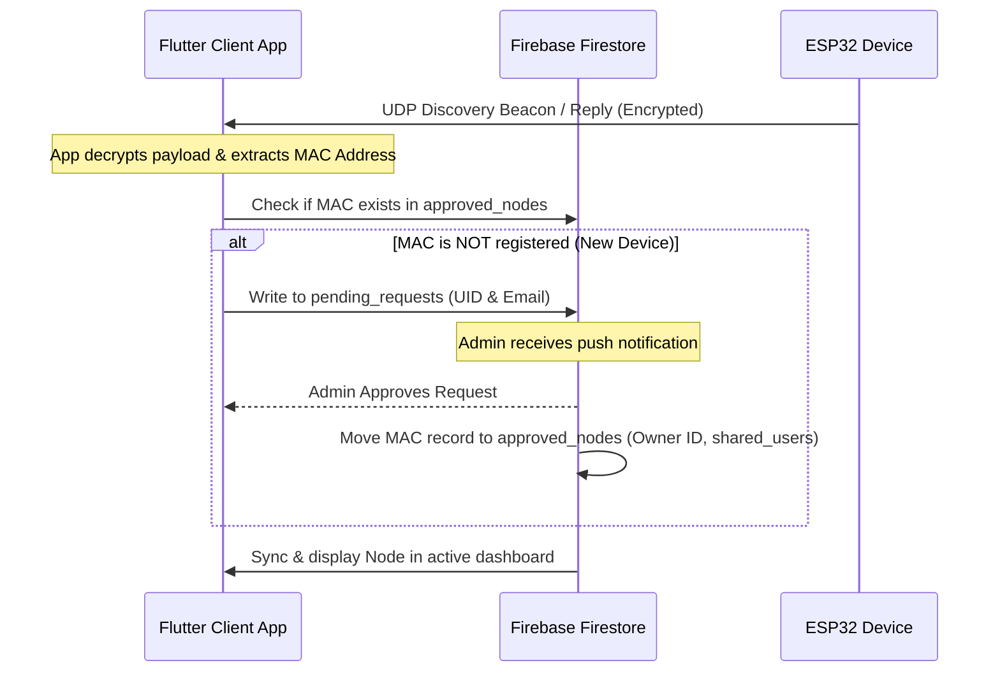

# Flutter Client-Side App: Development, Build & Deployment Specification Report

এই ডকুমেন্টটি ESP32 firmware v2.1 আর্কিটেকচার, মেমোরি মডেল এবং সিকিউরিটি প্রোটোকলের উপর ভিত্তি করে তৈরি করা হয়েছে। এটি ফ্লাটার (Flutter) ক্লায়েন্ট অ্যাপ্লিকেশনের আর্কিটেকচারাল গাইডলাইন, লোকাল ও ক্লাউড কমিউনিকেশন ফ্লো, ক্রিপ্টোগ্রাফিক হ্যান্ডশেক, বিল্ড প্রসেস এবং ডেপ্লয়মেন্ট লজিক বিস্তারিতভাবে উপস্থাপন করে।

---

## ১. সিস্টেম আর্কিটেকচার ও ক্লায়েন্ট ইঞ্জিন (System Architecture Overview)

ফ্লাটার ক্লায়েন্ট অ্যাপ্লিকেশনটি হবে সম্পূর্ণ **Stateful** এবং বুদ্ধিমান (Stateful & Smart Client), যা সম্পূর্ণ **Stateless ESP32 Nodes**-এর প্রসেসিং এবং মেমোরি ওভারহেড হ্রাস করবে। নোডগুলো মেমোরিতে কোনো ডাইনামিক পাথের ট্র্যাকিং রাখবে না; তারা শুধুমাত্র কমান্ড এক্সিকিউট করবে এবং ডেটা পাবলিশ করে মেমোরি খালি করবে। অন্যদিকে, ক্লায়েন্ট অ্যাপ সব নোডের ডেটা রিসিভ করে লোকাল ক্যাশ ডাটাবেসে জমা রাখবে এবং রিয়েল-টাইমে UI রেন্ডার করবে।

### ক) হাইব্রিড কানেকশন মডেল (WebSocket + MQTT)
ক্লায়েন্ট অ্যাপ্লিকেশনটি একটি **Connection Manager Engine** রান করবে যা লোকাল নেটওয়ার্ক ও ক্লাউড কানেকশন ডাইনামিকালি সুইচ করে।
* **WebSocket (Local - Primary):** ক্লায়েন্ট যখন নোডের সাথে একই ওয়াইফাই নেটওয়ার্কে থাকবে, তখন সরাসরি নোডের IP এবং পোর্ট `80` এর `/ws` এন্ডপয়েন্টে WebSocket সেশন তৈরি করবে। এতে কমান্ড ল্যাটেন্সি ২ মিলি-সেকেন্ডের নিচে নেমে আসে।
* **MQTT (Cloud/Fallback - Secondary):** লোকাল ওয়াইফাই কানেকশন না থাকলে বা ক্লায়েন্ট মোবাইল ডেটা ব্যবহার করলে, অ্যাপটি HiveMQ MQTT ব্রোকারের মাধ্যমে নোডের সাথে সংযোগ স্থাপন করবে (Secure TLS Port `8883`)।

### খ) ক্লায়েন্ট-সাইড ডেটা মডেল ও লোকাল পারসিস্টেন্স
মেমোরি অপ্টিমাইজেশন ও দ্রুত রেন্ডারিংয়ের জন্য অ্যাপ্লিকেশনে **Hive** বা **Isar** লোকাল নো-এসকিউএল ডাটাবেস ব্যবহার করা হবে।
* **টপিক পার্সিং লজিক:** ব্রোকার বা লোকাল সোর্স থেকে আগত সমস্ত মেসেজকে নিম্নোক্তভাবে সেগমেন্টেড করে লোকাল ক্যাশে সংরক্ষণ করা হবে:
  ```dart
  List<String> pathSegments = topic.split('/');
  String nodeMac = pathSegments[2]; // Index 2: nodes/[MAC_ADDRESS]
  String pathType = pathSegments[3]; // Index 3: config, loads, states, sensors, logs
  ```
* **ক্যাশ স্কিমা:** `nodeMac` কে প্রাইমারি কী ধরে নোড কনফিগারেশন, রিলে স্টেট এবং সেন্সর ভ্যালু ক্যাশ করা হবে।
  ```json
  {
    "mac_address": "A1B2C3D4E5F6",
    "ip": "192.168.1.100",
    "status": "online",
    "uptime": 12450,
    "states": {
      "light1": "ON",
      "fan_relay": "OFF"
    },
    "sensors": {
      "temperature": 28.5,
      "humidity": 65.0
    }
  }
  ```

---

## ২. সিকিউরিটি লেয়ার ও ক্রিপ্টোগ্রাফিক স্পেসিফিকেশন (Cryptographic Specification)

ক্লায়েন্ট অ্যাপকে ফার্মওয়্যারের HMAC-SHA256 কী ডেরাইভেশন এবং হার্ডওয়্যার-অ্যাক্সিলারেটেড AES-128-CBC ডিক্রিপশন লজিকের সাথে সম্পূর্ণ সামঞ্জস্যপূর্ণ হতে হবে।

### ক) কি ডেরিভেশন (HMAC-SHA256 Session Key K1)
আসল `api_key` কখনোই নেটওয়ার্কে ট্রান্সমিট করা যাবে না। প্রতিটি মেসেজের জন্য ক্লায়েন্ট এবং নোড উভয়ই টাইমস্ট্যাম্প ভিত্তিক একটি সেশন কী `K1` ডেরাইভ করবে।
* **সূত্র:** $K_1 = \text{HMAC-SHA256}(\text{key} = \text{api\_key}, \text{message} = \text{current\_unix\_timestamp})[0..16]$ (প্রথম ১৬ বাইট)।
* **Dart কোড ইমপ্লিমেন্টেশন:**
  ```dart
  import 'dart:convert';
  import 'package:crypto/crypto.dart';

  List<int> deriveSessionKey(String apiKey, String timestamp) {
    final keyBytes = utf8.encode(apiKey);
    final msgBytes = utf8.encode(timestamp);
    final hmac = Hmac(sha256, keyBytes);
    final digest = hmac.convert(msgBytes);
    return digest.bytes.sublist(0, 16); // Extract first 16 bytes for AES-128 Key
  }
  ```

### খ) পেলোড এনক্রিপশন ও ডিক্রিপশন (AES-128-CBC)
* **IV (Initialization Vector) হ্যান্ডলিং:** প্রতিটি এনক্রিপশনের সময় একটি ক্রিপ্টোগ্রাফিক্যালি সুরক্ষিত ১৬-বাইটের র্যান্ডম IV জেনারেট করতে হবে (`Random.secure()`)।
* **প্যাকেট ফরম্যাট:** `Base64( IV[16 bytes] || Ciphertext[N bytes] )`
* **ডিকোডিং ফ্লো:**
  1. Base64 ডেটা ডিকোড করে raw bytes সংগ্রহ করা।
  2. প্রথম ১৬ বাইটকে IV এবং অবশিষ্ট বাইটগুলোকে Ciphertext হিসেবে আলাদা করা।
  3. ডেরাইভড `K1` কী এবং IV ব্যবহার করে AES-CBC মোডে PKCS7 প্যাডিংসহ ডিক্রিপ্ট করা।
* **Dart কোড ইমপ্লিমেন্টেশন (using `encrypt` package):**
  ```dart
  import 'dart:convert';
  import 'dart:math';
  import 'dart:typed_data';
  import 'package:encrypt/encrypt.dart' as encrypt;

  String encryptPayload(String plainText, List<int> keyBytes) {
    final key = encrypt.Key(Uint8List.fromList(keyBytes));
    // Generate secure random 16-byte IV
    final random = Random.secure();
    final ivBytes = Uint8List.fromList(List<int>.generate(16, (_) => random.nextInt(256)));
    final iv = encrypt.IV(ivBytes);

    final encrypter = encrypt.Encrypter(encrypt.AES(key, mode: encrypt.AESMode.cbc, padding: 'PKCS7'));
    final encrypted = encrypter.encrypt(plainText, iv: iv);

    final combined = Uint8List(16 + encrypted.bytes.length);
    combined.setRange(0, 16, ivBytes);
    combined.setRange(16, combined.length, encrypted.bytes);

    return base64.encode(combined);
  }

  String decryptPayload(String base64Payload, List<int> keyBytes) {
    final combinedBytes = base64.decode(base64Payload);
    if (combinedBytes.length < 32) throw Exception("Invalid payload length");

    final ivBytes = combinedBytes.sublist(0, 16);
    final cipherBytes = combinedBytes.sublist(16);

    final key = encrypt.Key(Uint8List.fromList(keyBytes));
    final iv = encrypt.IV(Uint8List.fromList(ivBytes));

    final encrypter = encrypt.Encrypter(encrypt.AES(key, mode: encrypt.AESMode.cbc, padding: 'PKCS7'));
    return encrypter.decrypt(encrypt.Encrypted(cipherBytes), iv: iv);
  }
  ```

### গ) রি-প্লে প্রোটেকশন ও আইডেন্টিটি ভেরিফিকেশন (`mac4`)
* **টাইম উইন্ডো:** ক্লায়েন্ট রিকোয়েস্ট পাঠানোর সময় বর্তমান রিয়েল-টাইম Unix Epoch সেকেন্ড ইনজেক্ট করবে। নোড শুধুমাত্র $\pm 30$ সেকেন্ড রেঞ্জের ভেতরের মেসেজ প্রসেস করবে।
* **MAC4 ম্যাপিং:** কমান্ড পেলোডে অবশ্যই টার্গেট নোডের MAC অ্যাড্রেসের শেষ ৪টি ক্যারেক্টার যুক্ত করতে হবে:
  ```json
  {
    "action": "TURN_ON",
    "load_id": "light1",
    "mac4": "A1B2"
  }
  ```
  নোড ডিক্রিপশন শেষে পেলোডের `mac4` এর সাথে নিজের MAC মিলিয়ে নিশ্চিত হবে কমান্ডটি তার উদ্দেশ্যেই পাঠানো হয়েছে।
* **WebSocket প্যাকেট ফরম্যাট:** `[Timestamp_String]:[Base64_Encrypted_Payload]`
  * *উদাহরণ:* `1719876543:t5y8D...v8A==`

---

## ৩. ডায়নামিক ডিসকভারি ও পেয়ারিং লজিক (UDP & Firebase Integration)

লোকাল আইপি পরিবর্তিত হলেও ডিভাইস ট্র্যাকিং সচল রাখতে এবং নতুন ডিভাইস সিকিউরলি পেয়ার করতে একটি সুনির্দিষ্ট নেটওয়ার্ক প্রোটোকল ব্যবহার করা হবে।

### ক) UDP ডিসকভারি হ্যান্ডলিং (Port 4210)
১. **প্যাসিভ লিসেনিং (Discovery Beacon):** নোড প্রতি ১৫ সেকেন্ড পর পর লোকাল নেটওয়ার্কে UDP ব্রডকাস্ট পাঠায়: `[Timestamp]:[Base64]`। অ্যাপটি UDP পোর্ট `4210` এ লিসেন করবে এবং ডিফল্ট বা পেয়ার করা `api_key` দিয়ে ডিক্রিপ্ট করবে। ডিক্রিপ্টেড মেসেজের ফরম্যাট: `ESPHOME_DISCOVERY:[IP]:[MAC]:[UPTIME]`।
২. **অ্যাক্টিভ কোয়েরি (Discovery Query):** অ্যাপ যখন কোনো নোডকে সার্চ করবে, তখন সে ব্রডকাস্টে `ESPHOME_QUERY` প্যাকেট এনক্রিপ্ট করে পাঠাবে। নোড তা ডিক্রিপ্ট করে অ্যাপের আইপিতে এনক্রিপ্টেড আকারে `ESPHOME_REPLY:[IP]:[MAC]:[UPTIME]` রেসপন্স করবে।

### খ) ফায়ারবেস রিলেশনাল পারমিশন ও পেয়ারিং ফ্লো
অ্যাপের সিকিউরিটি ও মাল্টি-ইউজার আইসোলেশনের জন্য Firebase Authentication এবং Cloud Firestore ব্যবহার করা হবে।



---

## ৪. ফ্লাটার অ্যাপ বিল্ড প্রসেস (Flutter Build Process)

প্রোডাকশন-গ্রেড সিকিউরিটি বজায় রাখতে ফ্লাটার অ্যাপ্লিকেশনের সোর্স কোড অবফাসকেশন এবং সিক্রেট কী প্রিজারভেশন করা অত্যন্ত জরুরি।

### ক) সিক্রেট কী ম্যানেজমেন্ট (Secure Secret Injection)
কোনো ধরণের সিক্রেট কী (Firebase configuration, MQTT credentials, বা default API keys) সরাসরি গিট রিপোজিটরিতে সাবমিট করা যাবে না। এগুলো বিল্ড-টাইমে ইনজেক্ট করতে হবে।
* **Dart Defines ব্যবহার:** বিল্ড স্ক্রিপ্টে `--dart-define-from-file` বা `--dart-define` ফ্লাগ ব্যবহার করা হবে।
  ```bash
  flutter build apk --release \
    --dart-define=MQTT_BROKER_HOST=494f4376e75a419193b3ddbd54f2338d.s1.eu.hivemq.cloud \
    --dart-define=MQTT_PORT=8883 \
    --dart-define=DEFAULT_API_KEY=my_secure_fallback_key
  ```
* **রানটাইম স্টোরেজ:** অ্যাপ রিস্টার্টে কী সুরক্ষিত রাখতে **`flutter_secure_storage`** প্যাকেজ ব্যবহার করা হবে যা Android-এ Keystore এবং iOS-এ Keychain-এ ডেটা এনক্রিপ্ট করে রাখে।

### খ) বিল্ড ফ্লেভার্স (Build Flavors)
এনভায়রনমেন্ট কনফিগারেশনের জন্য অ্যান্ড্রয়েড এবং আইওএস প্রজেক্টে ৩টি ফ্লেভার ব্যবহার করা হবে:
1. **Development (dev):** লোকাল মক ব্রোকার এবং টেস্ট ফায়ারবেস ডাটাবেস।
2. **Staging (staging):** প্রি-প্রোডাকশন HiveMQ ক্লাস্টার এবং টেস্ট ইউজার গ্রুপ।
3. **Production (prod):** লাইভ প্রোডাকশন ডেটাবেস, এনক্রিপশন কী এবং অ্যাপ স্টোর প্রোফাইল।

### গ) কোড অবফাসকেশন ও হার্ডেনিং (Code Hardening)
বাইনারি রিভার্স-ইঞ্জিনিয়ারিং প্রতিহত করার জন্য বিল্ড অপ্টিমাইজেশন আবশ্যক:
* **Android / iOS Obfuscation:**
  ```bash
  flutter build apk --release --obfuscate --split-debug-info=build/app/outputs/symbols
  flutter build ipa --release --obfuscate --split-debug-info=build/ios/outputs/symbols
  ```
* **ProGuard / R8 (Android):** `android/app/build.gradle` ফাইলে `minifyEnabled true` এবং `shrinkResources true` এনাবল করতে হবে এবং কাস্টম `proguard-rules.pro` রুল সেট করতে হবে:
  ```proguard
  # Preserve cryptographic classes & packages
  -keep class javax.crypto.** { *; }
  -keep class org.bouncycastle.** { *; }
  ```

---

## ৫. ডেপ্লয়মেন্ট ও সিআই/সিডি লজিক (Deployment & CI/CD)

অ্যাপ ডেভেলপমেন্ট স্পিড বাড়াতে এবং সিকিউর রিলিজ সাইকেল মেইনটেইন করার জন্য অটোমেটেড CI/CD পাইপলাইন ব্যবহার করা হবে।

### ক) Fastlane কনফিগারেশন
অ্যান্ড্রয়েড এবং আইওএস স্টোরে সরাসরি বিল্ড আপলোড করার জন্য Fastlane ব্যবহার করা হবে।
* **iOS (Fastfile):**
  ```ruby
  default_platform(:ios)
  platform :ios do
    desc "Deploy a new build to TestFlight"
    lane :beta do
      setup_ci if ENV["CI"]
      match(type: "appstore") # Auto provisioning profile sync
      build_app(scheme: "Runner-prod", workspace: "Runner.xcworkspace")
      upload_to_testflight
    end
  end
  ```
* **Android (Fastfile):**
  ```ruby
  default_platform(:android)
  platform :android do
    desc "Deploy a new build to Google Play Internal Test"
    lane :beta do
      gradle(task: "clean bundleRelease")
      upload_to_play_store(track: "internal", apk: "../build/app/outputs/bundle/release/app-release.aab")
    end
  end
  ```

### খ) GitHub Actions CI/CD ওয়ার্কফ্লো
প্রতিটি রিলিজ ব্রাঞ্চে পুশ করার সাথে সাথে অ্যাপ অটোমেটিকালি বিল্ড ও সাইন হয়ে স্টোরে আপলোড হবে। নিচে প্রস্তাবিত `.github/workflows/deploy.yml` দেওয়া হলো:

```yaml
name: Deploy Flutter Client App

on:
  push:
    tags:
      - 'v*.*.*'

jobs:
  build:
    name: Build & Deploy
    runs-on: macos-latest
    steps:
      - name: Checkout Repository
        uses: actions/checkout@v3

      - name: Set up Java
        uses: actions/setup-java@v3
        with:
          distribution: 'zulu'
          java-version: '17'

      - name: Set up Flutter
        uses: subosito/flutter-action@v2
        with:
          flutter-version: '3.19.x'
          channel: 'stable'

      - name: Install Dependencies
        run: flutter pub get

      - name: Run Tests & Lints
        run: |
          flutter analyze
          flutter test

      - name: Decode Android Keystore & Decrypt Secrets
        env:
          KEYSTORE_BASE64: ${{ secrets.ANDROID_KEYSTORE_BASE64 }}
        run: |
          echo "$KEYSTORE_BASE64" | base64 --decode > android/app/release.jks

      - name: Install Apple Certificates and Provisioning Profiles
        env:
          BUILD_CERTIFICATE_BASE64: ${{ secrets.BUILD_CERTIFICATE_BASE64 }}
          P12_PASSWORD: ${{ secrets.P12_PASSWORD }}
          PROVISION_PROFILE_BASE64: ${{ secrets.PROVISION_PROFILE_BASE64 }}
          KEYCHAIN_PASSWORD: ${{ secrets.KEYCHAIN_PASSWORD }}
        run: |
          # Certificate & Provisioning key importing scripts...

      - name: Build Android App Bundle (Release)
        run: |
          flutter build appbundle --release --obfuscate --split-debug-info=build/app/outputs/symbols \
            --dart-define=MQTT_BROKER_HOST=${{ secrets.MQTT_HOST }} \
            --dart-define=MQTT_USER=${{ secrets.MQTT_USER }} \
            --dart-define=MQTT_PASS=${{ secrets.MQTT_PASS }}

      - name: Build iOS IPA (Release)
        run: |
          flutter build ipa --release --obfuscate --split-debug-info=build/ios/outputs/symbols \
            --export-method=app-store \
            --dart-define=MQTT_BROKER_HOST=${{ secrets.MQTT_HOST }} \
            --dart-define=MQTT_USER=${{ secrets.MQTT_USER }} \
            --dart-define=MQTT_PASS=${{ secrets.MQTT_PASS }}

      - name: Run Fastlane (Deploy to TestFlight & Google Play)
        env:
          APP_STORE_CONNECT_API_KEY: ${{ secrets.APP_STORE_CONNECT_API_KEY }}
          PLAY_STORE_JSON_KEY: ${{ secrets.PLAY_STORE_JSON_KEY }}
        run: |
          cd android && bundle exec fastlane beta
          cd ../ios && bundle exec fastlane beta
```

---

## ৬. ফার্মওয়্যার ও অ্যাপ সামঞ্জস্যতা এবং ওভার-দ্য-এয়ার (OTA) স্ট্রেটেজি

১. **API Versioning:** প্রতিটি রিকোয়েস্টে হেডার বা WebSocket পে-লোডে `api_version: "2.1"` ট্র্যাক পাঠানো হবে। যদি ফার্মওয়্যার আপডেটের মাধ্যমে ব্রেকিং চেঞ্জ আসে, তবে পুরোনো অ্যাপে `Update Required` অ্যালার্ট শো করবে।
2. **Local HTTP fallback OTA:** লোকাল মোডে অ্যাপের ড্যাশবোর্ড থেকে ফার্মওয়্যার `.bin` ফাইল সিলেক্ট করে সরাসরি ESP32-এর AsyncWebServer এ আপলোড করে ওটিএ আপডেট করা যাবে।
3. **MQTTS Fallback OTA Trigger (আপাতত নিষ্ক্রিয়):** ক্লাউড মোডে অ্যাপ থেকে `/commands/sys` টপিকে এনক্রিপ্ট করে OTA URL পাঠানোর লজিক এবং নোডের অটো-ডাউনলোড মেকানিজমটি সিকিউরিটির জন্য আপাতত নিষ্ক্রিয় (Disabled) থাকবে। আপডেট শুধুমাত্র ইউজার ম্যানুয়ালি লোকাল মোডে লোকাল ফাইল আপলোডের মাধ্যমে করতে পারবেন।
