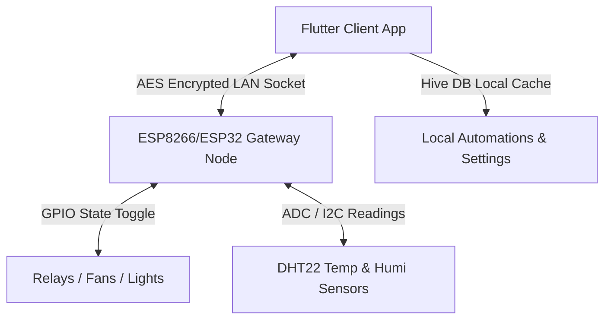

# ESPHome Smart IoT Gateway & Control Client

A comprehensive, production-ready smart home IoT ecosystem consisting of a C++ firmware codebase for ESP8266/ESP32 microcontrollers and a modern, high-performance Flutter client application. It enables real-time sensor telemetry tracking, secure local load controllers, and dynamic automation rule deployment.

---

## 📸 System Architecture



This project bridges the gap between hardware nodes and user interface screens:
1. **Firmware (`ESPHome.ino`):** Runs on hardware nodes to read sensor coordinates, govern GPIO switches, and handle client handshakes.
2. **Client App (`frontend`):** Built with Flutter to discover devices, render metrics, configure multi-condition rules, and display realtime analytics.

---

## 🚀 Key Ecosystem Features

* **Glassmorphic UI Design:** Standardized glassmorphism (`GlassContainer`) layout system featuring backdrop filters, thin borders, and glowing interactive selectors.
* **Dynamic Nodes State Engine & Simulator:** Governs live data telemetry of IoT gateways using a Riverpod `StateNotifier`. Features a background periodic simulator that fluctuates temperature and humidity values to mirror active real-world operations.
* **Interactive Load Management (GPIO Binding):** Supports dynamic pin assignment using a strict whitelisting protocol (`2, 4, 12, 13, 14, 15, 16`). Prevents conflict mapping by dynamically displaying only unused GPIO channels.
* **Interactive Sliding Switch Selectors:** Sleek haptic-like option togglers (Toggle/Direct switch logic and 12h/24h time formatting configurations) with custom-painted elastic animations.
* **Custom Symmetric Spinning Fan:** Symmetrical custom-drawn 3-blade SVG fan widget that rotates smoothly under `AnimationController` to visualize active status without off-center wobbles.
* **Inline Node-Scoped Automations:** Configure rules directly from a specific node control view. Supports operators **ABOVE** and **UNDER** combined with a custom hysteresis margin to eliminate trigger oscillations.
* **Global Automations:** Deploy single-condition rules that automatically split and distribute matching trigger definitions to target channels on all connected nodes.
* **Live Telemetry Trend Charting:** Real-time line graph plotting that connects to actual historical sensor values (`tempHistory`) and repaints dynamically as the background simulation fluctuates.
* **Robust Safety Locks:** Queries active automation rule states before allowing load deletion, blocking high-risk modifications and preventing state inconsistency.

---

## 📂 Repository Layout

```
.
├── ESPHome.ino                  # Microcontroller firmware entrypoint
├── src/                         # Supporting C++ header libraries
├── Architecture/                # Project design documentation
├── utils/                       # Automation scripts
│   └── tools/
│       └── build_apk.py         # Verbose Android build helper script
└── frontend/                    # Flutter Client Application
    ├── lib/
    │   ├── core/                # Router, theme, and common glass widgets
    │   └── features/            # Authentication, dashboard, control, settings, and setup
    ├── android/                 # Native Android platform config (permissions manifest)
    └── pubspec.yaml             # Dart dependencies specification
```

---

## 🛠️ Technology Stack

### Firmware & Hardware
- **Language:** C++ (Arduino Framework)
- **Platforms:** ESP8266, ESP32
- **Protocol:** AES-Decrypted TCP Local Network Sockets
- **Sensors Supported:** DHT22 (Temperature & Humidity), GPIO Relays

### Flutter Client
- **SDK Version:** Flutter / Dart SDK `^3.11.4`
- **State Management:** Riverpod (`StateNotifierProvider`)
- **Database & Cache:** HiveDB (`Hive`) for local encrypted configurations, device states, and rule profiles.
- **Routing:** GoRouter (centralized router registry with settings sub-paths).
- **Typography:** Google Fonts (Outfit, Inter, Outfit Bold)

---

## ⚡ Performance Optimizations

1. **Zero-IO Periodic Timers:** The 5-second telemetry simulator reads from an already open in-memory Hive box reference (`_rulesBox`), entirely bypassing disk operations during periodic ticks. This keeps the rendering pipeline jank-free.
2. **Post-Frame Animation Triggers:** Animation controller side-effects (`repeat()`, `stop()`) are deferred to `WidgetsBinding.instance.addPostFrameCallback`. This isolates UI rebuild triggers from the animation ticker and prevents frame-flickering.
3. **Low-Memory Gradle Setup:** Heap constraints configured inside `gradle.properties` restrict JVM footprint to `2048M`, allowing compilation to complete without system thrashing.

---

## ⚙️ Getting Started

### 1. Flash the Firmware
Ensure you have the Arduino IDE or PlatformIO installed:
1. Open [ESPHome.ino](file:///c:/Users/chaki/Desktop/ESPHome/ESPHome.ino) in your IDE.
2. Update the Wi-Fi credentials (`ssid`, `password`) and the AES Encryption Key to match your setups.
3. Flash the binary code to your ESP8266/ESP32 node.

### 2. Run the Flutter Client
Ensure you have a connected device/emulator running:
```bash
cd frontend
flutter pub get
flutter run
```

### 3. Verify Code Quality
To run the static analysis verification check:
```bash
flutter analyze
```

### 4. Build Release Android APK
Run the custom Python script to build the release package verbosely:
```bash
python utils/tools/build_apk.py --verbose
```
